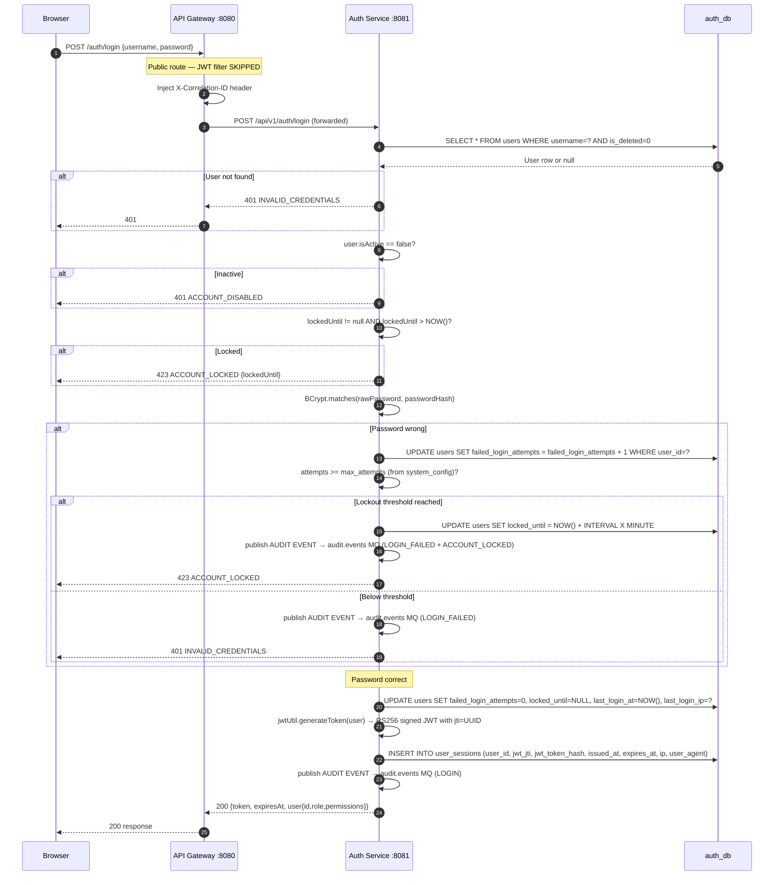
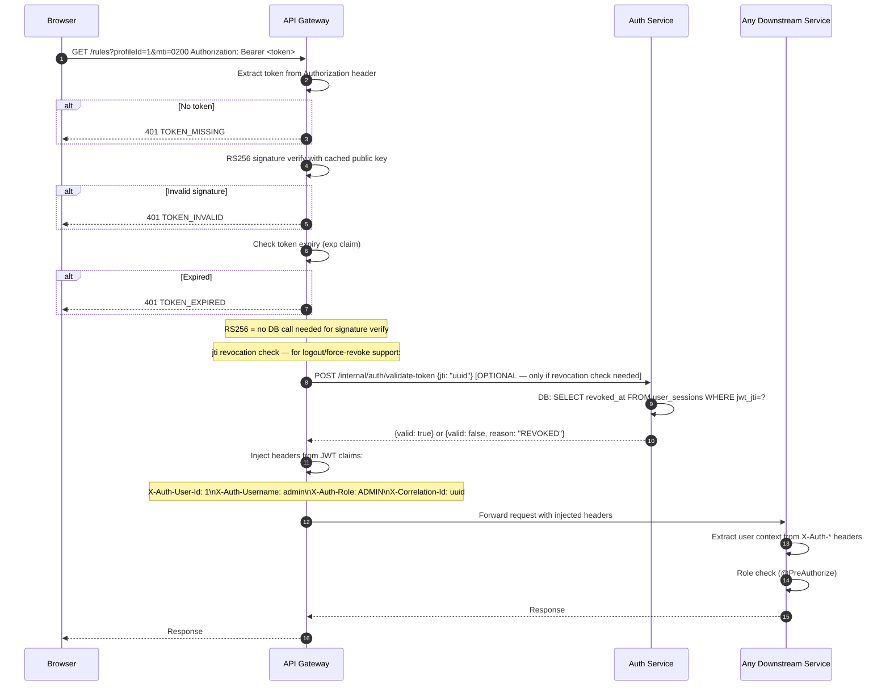
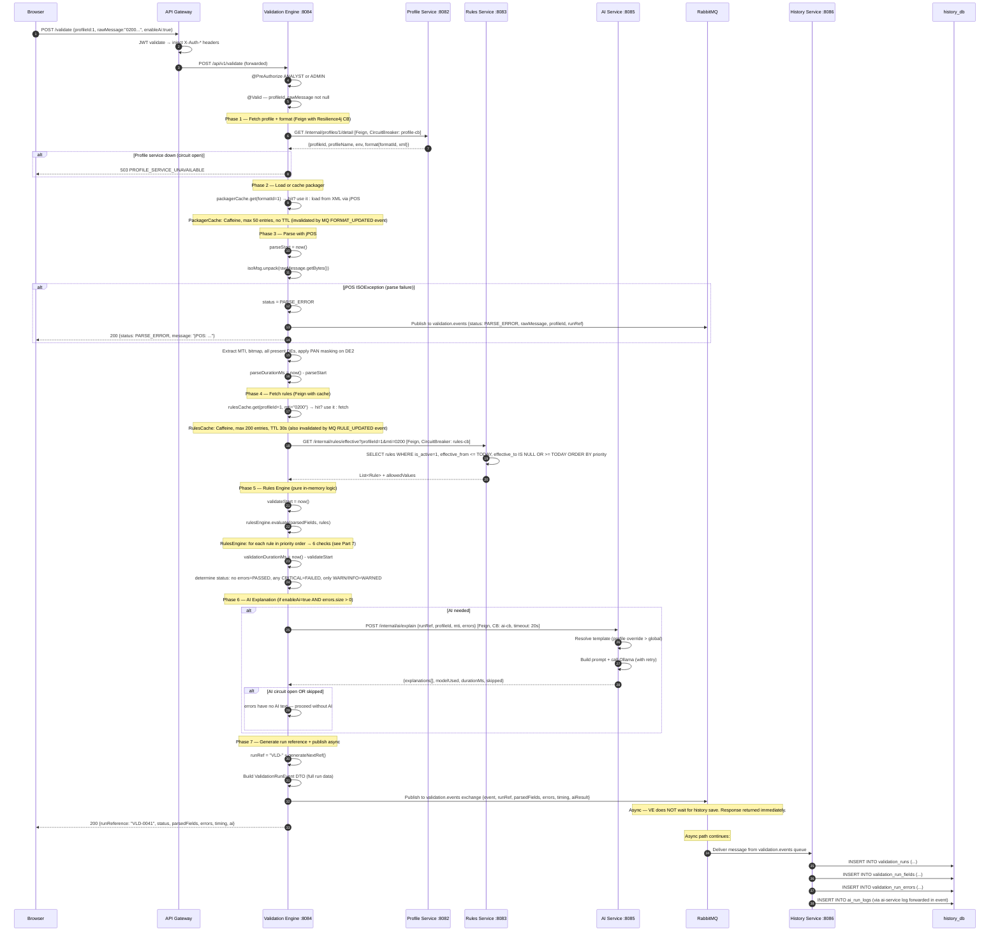
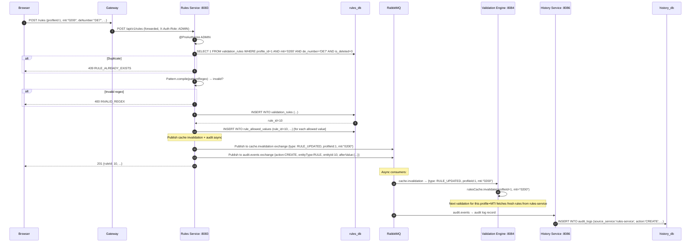
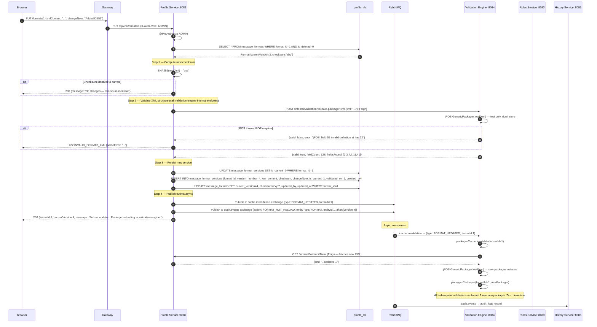
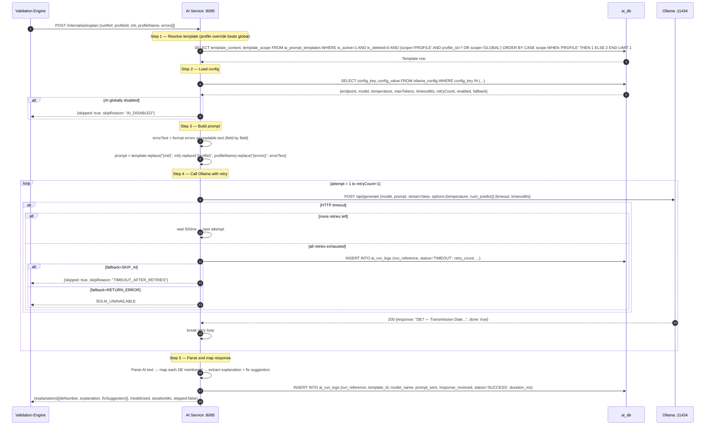
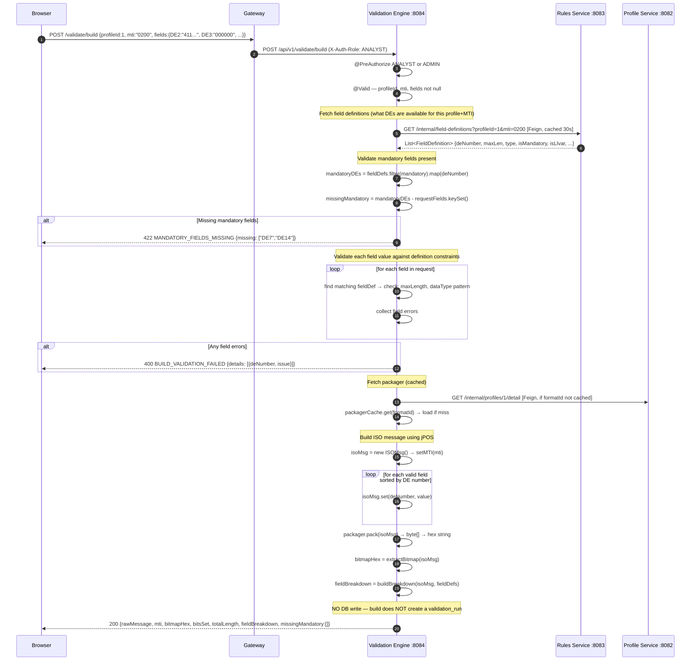
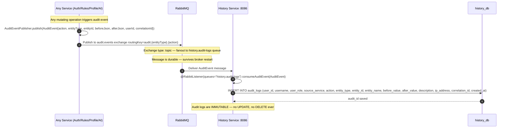

# ISO 8583 VALIDATOR — MICROSERVICES ARCHITECTURE BLUEPRINT
## Production-Grade | Spring Boot 3.2 | Spring Cloud | MySQL | jPOS | Ollama | RabbitMQ

---

# PART 1 — SYSTEM OVERVIEW

## 1.1 Architecture Diagram

```
                        ┌─────────────────────────────────────────────────────────────────────┐
                        │                     CLIENT (React)                                  │
                        └───────────────────────────┬─────────────────────────────────────────┘
                                                    │ HTTPS
                        ┌───────────────────────────▼─────────────────────────────────────────┐
                        │               NGINX (TLS termination + static files)                │
                        └───────────────────────────┬─────────────────────────────────────────┘
                                                    │
                        ┌───────────────────────────▼─────────────────────────────────────────┐
                        │           API GATEWAY  :8080  (Spring Cloud Gateway)                │
                        │   • JWT validation at edge (RS256 public key)                       │
                        │   • Route to downstream services                                    │
                        │   • Rate limiting (Redis token bucket)                              │
                        │   • Correlation-ID injection                                        │
                        │   • CORS                                                            │
                        └──┬──────┬──────┬──────┬──────┬──────┬───────────────────────────────┘
                           │      │      │      │      │      │
          ┌────────────────┘      │      │      │      │      └──────────────────┐
          │                       │      │      │      │                         │
          ▼                       ▼      │      ▼      ▼                         ▼
  ┌───────────────┐  ┌────────────────┐ │ ┌──────────────────┐  ┌───────────────────────┐
  │  AUTH SERVICE │  │ PROFILE SERVICE│ │ │  RULES SERVICE   │  │  AI SERVICE           │
  │     :8081     │  │     :8082      │ │ │      :8083       │  │     :8085             │
  │               │  │                │ │ │                  │  │                       │
  │  auth_db      │  │  profile_db    │ │ │  rules_db        │  │  ai_db                │
  └───────────────┘  └────────────────┘ │ └──────────────────┘  └───────────────────────┘
                                        │
                                        ▼
                        ┌───────────────────────────────────────┐
                        │     VALIDATION ENGINE    :8084        │
                        │     (jPOS lives here — stateless)     │
                        │     Calls: Profile, Rules, AI         │
                        │     In-memory packager cache          │
                        │     In-memory rules cache (30s TTL)   │
                        └───────────────────┬───────────────────┘
                                            │ publishes async
                        ┌───────────────────▼───────────────────┐
                        │           RABBITMQ  :5672             │
                        │   Exchanges: validation.events        │
                        │              audit.events             │
                        │              cache.invalidation       │
                        └───────────────────┬───────────────────┘
                                            │ consumes
                        ┌───────────────────▼───────────────────┐
                        │   HISTORY & AUDIT SERVICE    :8086    │
                        │   validation_runs, audit_logs         │
                        │   history_db                          │
                        └───────────────────────────────────────┘

    ┌──────────────────────────────────────────────────────────────┐
    │  INFRASTRUCTURE                                              │
    │  • Eureka Server  :8761   (Service Registry)                │
    │  • Config Server  :8888   (Spring Cloud Config)             │
    │  • Redis          :6379   (Rate limit + Gateway route cache)│
    │  • Ollama         :11434  (AI — accessed only by AI Service)│
    └──────────────────────────────────────────────────────────────┘
```

## 1.2 Service Summary

| # | Service | Port | DB Schema | Core Responsibility |
|---|---------|------|-----------|---------------------|
| 1 | `service-registry` | 8761 | — | Eureka — service discovery |
| 2 | `config-server` | 8888 | Git/FS | Centralized application properties |
| 3 | `api-gateway` | 8080 | Redis | Routing, JWT edge validation, rate limiting, CORS |
| 4 | `auth-service` | 8081 | `auth_db` | Users, sessions, JWT issue/revoke, RBAC, system config |
| 5 | `profile-service` | 8082 | `profile_db` | Switch profiles, message formats, XML hot reload |
| 6 | `rules-service` | 8083 | `rules_db` | Validation rules, field definitions/catalog, bulk ops |
| 7 | `validation-engine` | 8084 | Stateless | jPOS parse, rule evaluation, message builder |
| 8 | `ai-service` | 8085 | `ai_db` | Prompt templates, Ollama calls, AI config |
| 9 | `history-service` | 8086 | `history_db` | Validation runs, audit logs, analytics |

## 1.3 Technology Stack

| Layer | Technology | Version | Justification |
|---|---|---|---|
| Service Framework | Spring Boot | 3.2.x | Industry standard, native cloud support |
| Service Discovery | Spring Cloud Eureka | 2023.0.x | Simple, proven, REST-based discovery |
| API Gateway | Spring Cloud Gateway | 2023.0.x | Non-blocking, reactive, filter chain |
| Config | Spring Cloud Config | 2023.0.x | Git-backed, env-aware config |
| Service Comms | OpenFeign + RestTemplate | — | Feign for sync, RestTemplate for internal |
| Circuit Breaker | Resilience4j | 3.x | Feign-integrated CB, retry, bulkhead |
| Async Messaging | RabbitMQ + Spring AMQP | 3.6.x | Reliable audit events, cache invalidation |
| ISO Parsing | jPOS | 2.1.x | Only in validation-engine |
| Database | MySQL | 8.0+ | Per-service isolated schema |
| ORM | Spring Data JPA + Hibernate | — | Standard |
| Auth | Spring Security + JWT (JJWT) | — | RS256 asymmetric keys |
| Cache | Caffeine (in-process) | — | Packager + rules cache in validation-engine |
| Rate Limiting | Redis + Spring Cloud Gateway | — | Token bucket per IP/user |
| Observability | Spring Actuator + Micrometer | — | Health, metrics, tracing headers |
| Build | Maven (multi-module) | 3.9.x | Mono-repo multi-module structure |

## 1.4 Communication Patterns

### Synchronous (REST via Feign)
```
validation-engine ──GET──► profile-service   (fetch format XML + profile details)
validation-engine ──GET──► rules-service     (fetch effective rules for profile+MTI)
validation-engine ──POST─► ai-service        (request AI explanation)
api-gateway       ──POST─► auth-service      (token introspection — optional, RS256 preferred)
```

### Asynchronous (RabbitMQ)
```
validation-engine ──PUBLISH──► validation.events exchange
  └─► history-service CONSUMES ──► Persists validation_run + fields + errors

all-services ──PUBLISH──► audit.events exchange
  └─► history-service CONSUMES ──► Persists audit_logs

rules-service ──PUBLISH──► cache.invalidation exchange (RULE_UPDATED, RULE_DELETED)
  └─► validation-engine CONSUMES ──► Evicts rules cache for profile+MTI

profile-service ──PUBLISH──► cache.invalidation exchange (FORMAT_UPDATED)
  └─► validation-engine CONSUMES ──► Evicts packager cache + reloads from profile-service
```

## 1.5 JWT Strategy (RS256 — Asymmetric)

```
auth-service holds:  private key (signs JWT)
all services hold:   public key (verify signature — NO call to auth-service needed per request)
api-gateway:         verifies JWT signature with public key → extracts userId, role → forwards as headers
each service:        re-verifies JWT from X-Auth-User headers OR directly from token (defense-in-depth)
```

**JWT Payload:**
```json
{
  "sub": "1",
  "username": "admin",
  "role": "ADMIN",
  "iat": 1715694622,
  "exp": 1715723422,
  "jti": "uuid-session-id"
}
```

## 1.6 Cross-Cutting Concerns

| Concern | Implementation |
|---|---|
| Correlation ID | Gateway injects `X-Correlation-ID` header → all services forward → all logs include it |
| Request Logging | `CommonsRequestLoggingFilter` per service — logs method, path, user, correlation ID |
| Error Envelope | Shared `ApiResponse<T>` from `common-lib` — all services return identical structure |
| PAN Masking | `PanMaskingUtil` in `common-lib` — masking before any log or DB write |
| Health Checks | Spring Actuator `/actuator/health` + `/actuator/info` on every service |
| Distributed Tracing | Micrometer Tracing — trace ID propagated via `traceparent` header |

---

# PART 2 — INFRASTRUCTURE SERVICES

## 2.1 RabbitMQ — Exchanges, Queues, Bindings

```
EXCHANGE: validation.events  (type: direct, durable: true)
  Binding: routingKey=run.completed → Queue: history.validation-runs (durable)

EXCHANGE: audit.events  (type: topic, durable: true)
  Binding: routingKey=audit.#  → Queue: history.audit-logs (durable)
  Topics:
    audit.auth.*         → login, logout, password change
    audit.rule.*         → create, update, delete
    audit.format.*       → update, rollback, reload
    audit.profile.*      → create, update, test-connection
    audit.ai.*           → config change, prompt change
    audit.user.*         → create, update, delete, role change

EXCHANGE: cache.invalidation  (type: fanout, durable: true)
  Binding: → Queue: validation-engine.cache-invalidation (durable)
  Messages:
    { "type": "RULE_UPDATED",   "profileId": 1, "mti": "0200" }
    { "type": "RULE_DELETED",   "profileId": 1, "mti": "0200" }
    { "type": "FORMAT_UPDATED", "formatId": 1 }
    { "type": "FORMAT_ROLLED_BACK", "formatId": 1 }
```

**Standard Message Envelope (all MQ messages):**
```json
{
  "eventId": "uuid",
  "eventType": "VALIDATION_RUN_COMPLETED",
  "sourceService": "validation-engine",
  "correlationId": "req-uuid",
  "timestamp": "2025-05-14T14:30:22Z",
  "payload": { ... }
}
```

## 2.2 API Gateway — Route Configuration

```yaml
spring:
  cloud:
    gateway:
      routes:
        - id: auth-service
          uri: lb://auth-service
          predicates: [Path=/auth/**, /users/**, /config/**]
          filters:
            - StripPrefix=0
            - name: RequestRateLimiter
              args: { redis-rate-limiter.replenishRate: 20, redis-rate-limiter.burstCapacity: 40 }

        - id: profile-service
          uri: lb://profile-service
          predicates: [Path=/profiles/**, /formats/**]
          filters:
            - JwtAuthFilter    ← custom filter — validates JWT, injects X-Auth-* headers
            - AuditFilter      ← logs every request with correlation ID
            - StripPrefix=0

        - id: rules-service
          uri: lb://rules-service
          predicates: [Path=/rules/**]
          filters: [JwtAuthFilter, AuditFilter, StripPrefix=0]

        - id: validation-engine
          uri: lb://validation-engine
          predicates: [Path=/validate/**, /validate/build]
          filters: [JwtAuthFilter, AuditFilter, StripPrefix=0]

        - id: ai-service
          uri: lb://ai-service
          predicates: [Path=/ai/**]
          filters: [JwtAuthFilter, AuditFilter, StripPrefix=0]

        - id: history-service
          uri: lb://history-service
          predicates: [Path=/history/**, /audit/**]
          filters: [JwtAuthFilter, AuditFilter, StripPrefix=0]
```

**Gateway JwtAuthFilter — what it does:**
1. Extract `Authorization: Bearer <token>` header
2. Verify RS256 signature with public key
3. Check expiry
4. Inject downstream headers: `X-Auth-User-Id`, `X-Auth-Username`, `X-Auth-Role`, `X-Correlation-Id`
5. Reject with 401 if any check fails
6. Public routes (`/auth/login`, `/auth/logout`, `/actuator/**`) bypass JWT filter

---

# PART 3 — DATABASE SCHEMAS

> Every table, every column, every constraint, every index. Zero omissions. Additions over original: `field_definitions` table (fixes hardcoded frontend catalog), `ollama_config` table (replaces generic `app_config` for AI concerns), `system_config` stays in auth_db.

---

## 3.1 `auth_db`

### Table: `users`

```sql
CREATE TABLE users (
  user_id               BIGINT         NOT NULL AUTO_INCREMENT,
  username              VARCHAR(50)    NOT NULL,
  password_hash         VARCHAR(255)   NOT NULL                  COMMENT 'BCrypt hash — NEVER store plaintext',
  full_name             VARCHAR(100)   NOT NULL,
  email                 VARCHAR(150)   NULL,
  avatar_initials       VARCHAR(5)     NULL                      COMMENT 'e.g. JD — derived from full_name on create',
  role                  ENUM('ADMIN','ANALYST','VIEWER') NOT NULL DEFAULT 'VIEWER',
  is_active             TINYINT(1)     NOT NULL DEFAULT 1,
  is_deleted            TINYINT(1)     NOT NULL DEFAULT 0,
  last_login_at         DATETIME       NULL,
  last_login_ip         VARCHAR(45)    NULL                      COMMENT 'IPv4 or IPv6',
  password_changed_at   DATETIME       NULL,
  failed_login_attempts INT            NOT NULL DEFAULT 0,
  locked_until          DATETIME       NULL                      COMMENT 'NULL = not locked',
  created_at            DATETIME       NOT NULL DEFAULT CURRENT_TIMESTAMP,
  updated_at            DATETIME       NOT NULL DEFAULT CURRENT_TIMESTAMP ON UPDATE CURRENT_TIMESTAMP,
  created_by            BIGINT         NULL                      COMMENT 'FK to users.user_id — NULL for seed admin',
  updated_by            BIGINT         NULL,

  PRIMARY KEY (user_id),
  UNIQUE KEY uk_users_username (username),
  UNIQUE KEY uk_users_email (email),
  KEY idx_users_role (role),
  KEY idx_users_is_active (is_active),
  KEY idx_users_is_deleted (is_deleted),
  CONSTRAINT fk_users_created_by FOREIGN KEY (created_by) REFERENCES users (user_id),
  CONSTRAINT fk_users_updated_by FOREIGN KEY (updated_by) REFERENCES users (user_id)
) ENGINE=InnoDB DEFAULT CHARSET=utf8mb4 COLLATE=utf8mb4_unicode_ci
  COMMENT='Platform users — RBAC roles enforced at gateway and service level';
```

### Table: `user_sessions`

```sql
CREATE TABLE user_sessions (
  session_id       BIGINT        NOT NULL AUTO_INCREMENT,
  user_id          BIGINT        NOT NULL,
  jwt_jti          VARCHAR(36)   NOT NULL                       COMMENT 'JWT jti claim — UUID — used for revocation lookup without hashing',
  jwt_token_hash   VARCHAR(64)   NOT NULL                       COMMENT 'SHA-256(token) — for direct token revocation check',
  ip_address       VARCHAR(45)   NULL,
  user_agent       TEXT          NULL,
  issued_at        DATETIME      NOT NULL,
  expires_at       DATETIME      NOT NULL,
  revoked_at       DATETIME      NULL                           COMMENT 'NULL = still valid',
  revoke_reason    VARCHAR(100)  NULL                           COMMENT 'LOGOUT, ADMIN_REVOKE, PASSWORD_CHANGE, ROLE_CHANGE',
  is_active        TINYINT(1)    NOT NULL DEFAULT 1,
  created_at       DATETIME      NOT NULL DEFAULT CURRENT_TIMESTAMP,

  PRIMARY KEY (session_id),
  UNIQUE KEY uk_sessions_jti (jwt_jti),
  UNIQUE KEY uk_sessions_token_hash (jwt_token_hash),
  KEY idx_sessions_user_id (user_id),
  KEY idx_sessions_is_active (is_active),
  KEY idx_sessions_expires_at (expires_at),
  CONSTRAINT fk_sessions_user FOREIGN KEY (user_id) REFERENCES users (user_id) ON DELETE CASCADE
) ENGINE=InnoDB DEFAULT CHARSET=utf8mb4 COLLATE=utf8mb4_unicode_ci
  COMMENT='JWT session tracking — supports revocation. Queried by jti or token hash.';
```

### Table: `system_config`

```sql
CREATE TABLE system_config (
  config_id      BIGINT        NOT NULL AUTO_INCREMENT,
  config_key     VARCHAR(100)  NOT NULL,
  config_value   LONGTEXT      NOT NULL,
  config_type    ENUM('STRING','INTEGER','BOOLEAN','JSON') NOT NULL DEFAULT 'STRING',
  description    VARCHAR(500)  NULL,
  is_sensitive   TINYINT(1)    NOT NULL DEFAULT 0              COMMENT '1 = mask value in all API responses',
  updated_at     DATETIME      NOT NULL DEFAULT CURRENT_TIMESTAMP ON UPDATE CURRENT_TIMESTAMP,
  updated_by     BIGINT        NULL,

  PRIMARY KEY (config_id),
  UNIQUE KEY uk_config_key (config_key),
  CONSTRAINT fk_config_updated_by FOREIGN KEY (updated_by) REFERENCES users (user_id)
) ENGINE=InnoDB DEFAULT CHARSET=utf8mb4 COLLATE=utf8mb4_unicode_ci
  COMMENT='Auth-domain system configuration. Auth service owns this. Other services have their own config tables.';

INSERT INTO system_config (config_key, config_value, config_type, description, is_sensitive) VALUES
('jwt.expiry_hours',       '8',   'INTEGER', 'JWT token expiry in hours',                      0),
('jwt.issuer',             'iso8583-validator', 'STRING', 'JWT iss claim value',               0),
('login.max_attempts',     '5',   'INTEGER', 'Failed logins before account lockout',           0),
('login.lockout_minutes',  '15',  'INTEGER', 'Lockout duration in minutes',                   0),
('login.session_max',      '3',   'INTEGER', 'Max concurrent sessions per user',              0),
('run.reference_prefix',   'VLD', 'STRING',  'Prefix for validation run references (shared)', 0);
```

---

## 3.2 `profile_db`

### Table: `message_formats`

```sql
CREATE TABLE message_formats (
  format_id        BIGINT        NOT NULL AUTO_INCREMENT,
  format_name      VARCHAR(100)  NOT NULL                       COMMENT 'e.g. ISO87 ASCII, ISO93 EBCDIC',
  iso_version      VARCHAR(60)   NOT NULL                       COMMENT 'e.g. ISO 8583-1:1987',
  encoding         ENUM('ASCII','EBCDIC','Binary') NOT NULL,
  total_fields     INT           NOT NULL DEFAULT 128,
  status           ENUM('active','inactive') NOT NULL DEFAULT 'active',
  current_version  INT           NOT NULL DEFAULT 1,
  checksum         VARCHAR(64)   NULL                           COMMENT 'SHA-256 of current XML — for change detection',
  description      TEXT          NULL,
  is_deleted       TINYINT(1)    NOT NULL DEFAULT 0,
  created_at       DATETIME      NOT NULL DEFAULT CURRENT_TIMESTAMP,
  updated_at       DATETIME      NOT NULL DEFAULT CURRENT_TIMESTAMP ON UPDATE CURRENT_TIMESTAMP,
  created_by       BIGINT        NOT NULL                       COMMENT 'user_id from auth_db — no FK across services',
  created_by_name  VARCHAR(100)  NOT NULL                       COMMENT 'Snapshot of username at creation time',
  updated_by       BIGINT        NULL,
  updated_by_name  VARCHAR(100)  NULL                           COMMENT 'Snapshot of username at update time',

  PRIMARY KEY (format_id),
  UNIQUE KEY uk_formats_name (format_name),
  KEY idx_formats_status (status),
  KEY idx_formats_is_deleted (is_deleted)
) ENGINE=InnoDB DEFAULT CHARSET=utf8mb4 COLLATE=utf8mb4_unicode_ci
  COMMENT='ISO8583 format definitions. XML config drives jPOS GenericPackager in validation-engine.';
```

### Table: `message_format_versions`

```sql
CREATE TABLE message_format_versions (
  version_id       BIGINT        NOT NULL AUTO_INCREMENT,
  format_id        BIGINT        NOT NULL,
  version_number   INT           NOT NULL,
  xml_content      LONGTEXT      NOT NULL                       COMMENT 'Full jPOS GenericPackager XML',
  checksum         VARCHAR(64)   NOT NULL                       COMMENT 'SHA-256 of xml_content',
  change_note      VARCHAR(500)  NULL,
  is_current       TINYINT(1)    NOT NULL DEFAULT 0,
  validated_ok     TINYINT(1)    NOT NULL DEFAULT 0             COMMENT '1 = jPOS successfully loaded this XML (verified by validation-engine)',
  validated_at     DATETIME      NULL,
  created_at       DATETIME      NOT NULL DEFAULT CURRENT_TIMESTAMP,
  created_by       BIGINT        NOT NULL,
  created_by_name  VARCHAR(100)  NOT NULL,

  PRIMARY KEY (version_id),
  UNIQUE KEY uk_format_version (format_id, version_number),
  KEY idx_fmv_format_id (format_id),
  KEY idx_fmv_is_current (is_current),
  CONSTRAINT fk_fmv_format FOREIGN KEY (format_id) REFERENCES message_formats (format_id)
) ENGINE=InnoDB DEFAULT CHARSET=utf8mb4 COLLATE=utf8mb4_unicode_ci
  COMMENT='Version history of format XML — rollback by creating new version pointing to old XML';
```

### Table: `switch_profiles`

```sql
CREATE TABLE switch_profiles (
  profile_id              BIGINT        NOT NULL AUTO_INCREMENT,
  profile_name            VARCHAR(100)  NOT NULL,
  format_id               BIGINT        NOT NULL,
  environment             ENUM('PROD','UAT','DEV') NOT NULL,
  host                    VARCHAR(255)  NOT NULL,
  port                    INT           NOT NULL                COMMENT 'TCP port — valid range 1-65535',
  timezone                VARCHAR(100)  NOT NULL DEFAULT 'UTC'  COMMENT 'IANA timezone — used for DE7/DE12/DE13 parsing',
  connection_timeout_ms   INT           NOT NULL DEFAULT 30000,
  tpdu_enabled            TINYINT(1)    NOT NULL DEFAULT 0,
  tpdu_value              VARCHAR(20)   NULL                    COMMENT '10-digit TPDU header e.g. 6000000000 — required if tpdu_enabled=1',
  is_active               TINYINT(1)    NOT NULL DEFAULT 1,
  is_default              TINYINT(1)    NOT NULL DEFAULT 0      COMMENT 'Only one profile can be default — enforced at service level',
  last_used_at            DATETIME      NULL,
  last_tested_at          DATETIME      NULL,
  last_test_result        ENUM('OK','FAILED','UNTESTED') NOT NULL DEFAULT 'UNTESTED',
  last_test_message       VARCHAR(500)  NULL,
  last_test_latency_ms    INT           NULL,
  is_deleted              TINYINT(1)    NOT NULL DEFAULT 0,
  created_at              DATETIME      NOT NULL DEFAULT CURRENT_TIMESTAMP,
  updated_at              DATETIME      NOT NULL DEFAULT CURRENT_TIMESTAMP ON UPDATE CURRENT_TIMESTAMP,
  created_by              BIGINT        NOT NULL,
  created_by_name         VARCHAR(100)  NOT NULL,
  updated_by              BIGINT        NULL,
  updated_by_name         VARCHAR(100)  NULL,

  PRIMARY KEY (profile_id),
  UNIQUE KEY uk_profiles_name (profile_name),
  KEY idx_profiles_format_id (format_id),
  KEY idx_profiles_environment (environment),
  KEY idx_profiles_is_active (is_active),
  KEY idx_profiles_is_default (is_default),
  KEY idx_profiles_is_deleted (is_deleted),
  CONSTRAINT fk_profiles_format FOREIGN KEY (format_id) REFERENCES message_formats (format_id),
  CONSTRAINT chk_port_range CHECK (port BETWEEN 1 AND 65535),
  CONSTRAINT chk_tpdu_value CHECK (tpdu_enabled = 0 OR tpdu_value IS NOT NULL)
) ENGINE=InnoDB DEFAULT CHARSET=utf8mb4 COLLATE=utf8mb4_unicode_ci
  COMMENT='Switch connection profiles. Each profile binds a message format + host. Rules managed in rules-service.';
```

---

## 3.3 `rules_db`

### Table: `validation_rules`

```sql
CREATE TABLE validation_rules (
  rule_id           BIGINT        NOT NULL AUTO_INCREMENT,
  profile_id        BIGINT        NOT NULL                      COMMENT 'References switch_profiles.profile_id in profile_db — cross-service reference, no FK',
  profile_name      VARCHAR(100)  NOT NULL                      COMMENT 'Snapshot — denormalized for display without cross-service join',
  mti               VARCHAR(4)    NOT NULL                      COMMENT 'e.g. 0200, 0210, 0420, 0800, 0810',
  de_number         VARCHAR(10)   NOT NULL                      COMMENT 'e.g. DE2, DE3, MTI — matches field_definitions.de_number',
  field_name        VARCHAR(150)  NOT NULL,
  is_mandatory      TINYINT(1)    NOT NULL DEFAULT 0,
  min_length        INT           NULL,
  max_length        INT           NULL,
  exact_length      INT           NULL                          COMMENT 'Set if min=max — shorthand for fixed-length fields',
  data_type         ENUM('numeric','alpha','alphanumeric','binary','special') NOT NULL,
  pattern_regex     VARCHAR(500)  NULL                          COMMENT 'Java regex applied post basic-type check. NULL = no pattern check.',
  severity          ENUM('CRITICAL','WARNING','INFO') NOT NULL DEFAULT 'CRITICAL',
  priority          INT           NOT NULL DEFAULT 1            COMMENT 'Lower = evaluated first. Rules engine sorts by this.',
  is_active         TINYINT(1)    NOT NULL DEFAULT 1,
  effective_from    DATE          NULL                          COMMENT 'NULL = effective immediately',
  effective_to      DATE          NULL                          COMMENT 'NULL = no expiry',
  description       TEXT          NULL,
  is_deleted        TINYINT(1)    NOT NULL DEFAULT 0,
  created_at        DATETIME      NOT NULL DEFAULT CURRENT_TIMESTAMP,
  updated_at        DATETIME      NOT NULL DEFAULT CURRENT_TIMESTAMP ON UPDATE CURRENT_TIMESTAMP,
  created_by        BIGINT        NOT NULL,
  created_by_name   VARCHAR(100)  NOT NULL,
  updated_by        BIGINT        NULL,
  updated_by_name   VARCHAR(100)  NULL,

  PRIMARY KEY (rule_id),
  UNIQUE KEY uk_rule_profile_mti_de (profile_id, mti, de_number)   COMMENT 'One rule per DE per MTI per profile',
  KEY idx_rules_profile_mti (profile_id, mti),
  KEY idx_rules_is_active (is_active),
  KEY idx_rules_is_deleted (is_deleted),
  KEY idx_rules_priority (priority),
  KEY idx_rules_effective (effective_from, effective_to),
  CONSTRAINT chk_length_order CHECK (min_length IS NULL OR max_length IS NULL OR min_length <= max_length),
  CONSTRAINT chk_regex_compile CHECK (pattern_regex IS NULL OR LENGTH(pattern_regex) > 0)
) ENGINE=InnoDB DEFAULT CHARSET=utf8mb4 COLLATE=utf8mb4_unicode_ci
  COMMENT='Per-profile per-MTI per-DE validation rules. Editable at runtime without redeploy.';
```

### Table: `rule_allowed_values`

```sql
CREATE TABLE rule_allowed_values (
  value_id         BIGINT        NOT NULL AUTO_INCREMENT,
  rule_id          BIGINT        NOT NULL,
  allowed_value    VARCHAR(100)  NOT NULL,
  value_label      VARCHAR(255)  NULL                           COMMENT 'Human label e.g. Purchase, Cash Advance, Balance Enquiry',
  sort_order       INT           NOT NULL DEFAULT 0,
  created_at       DATETIME      NOT NULL DEFAULT CURRENT_TIMESTAMP,
  created_by       BIGINT        NOT NULL,
  created_by_name  VARCHAR(100)  NOT NULL,

  PRIMARY KEY (value_id),
  UNIQUE KEY uk_rule_value (rule_id, allowed_value),
  KEY idx_rav_rule_id (rule_id),
  CONSTRAINT fk_rav_rule FOREIGN KEY (rule_id) REFERENCES validation_rules (rule_id) ON DELETE CASCADE
) ENGINE=InnoDB DEFAULT CHARSET=utf8mb4 COLLATE=utf8mb4_unicode_ci
  COMMENT='Enum-style allowed values for a rule. CASCADE DELETE — values die with rule.';
```

### Table: `field_definitions`

> **NEW TABLE** — Fixes the critical production issue where `PROFILE_DE_CATALOG` was hardcoded in the React frontend. This table drives the Message Builder UI and is served by the rules-service.

```sql
CREATE TABLE field_definitions (
  definition_id      BIGINT        NOT NULL AUTO_INCREMENT,
  profile_id         BIGINT        NOT NULL                     COMMENT 'Cross-service ref to switch_profiles.profile_id',
  profile_name       VARCHAR(100)  NOT NULL                     COMMENT 'Snapshot',
  mti                VARCHAR(4)    NOT NULL,
  de_number          VARCHAR(10)   NOT NULL                     COMMENT 'e.g. DE2, DE3, MTI',
  field_name         VARCHAR(150)  NOT NULL,
  data_type          ENUM('numeric','alpha','alphanumeric','binary','special') NOT NULL,
  max_length         INT           NOT NULL,
  is_llvar           TINYINT(1)    NOT NULL DEFAULT 0           COMMENT '1 = LLVAR encoding (length-prefixed), 0 = FIXED',
  is_lllvar          TINYINT(1)    NOT NULL DEFAULT 0           COMMENT '1 = LLLVAR encoding',
  is_mandatory       TINYINT(1)    NOT NULL DEFAULT 0           COMMENT 'For message builder default selection',
  placeholder_value  VARCHAR(500)  NULL                         COMMENT 'Example value shown in builder UI',
  display_order      INT           NOT NULL DEFAULT 0           COMMENT 'Order in builder form — mandatory fields first',
  is_builder_visible TINYINT(1)    NOT NULL DEFAULT 1           COMMENT '0 = field exists in format but hidden from builder (e.g. bitmap DE1)',
  is_active          TINYINT(1)    NOT NULL DEFAULT 1,
  is_deleted         TINYINT(1)    NOT NULL DEFAULT 0,
  created_at         DATETIME      NOT NULL DEFAULT CURRENT_TIMESTAMP,
  updated_at         DATETIME      NOT NULL DEFAULT CURRENT_TIMESTAMP ON UPDATE CURRENT_TIMESTAMP,
  created_by         BIGINT        NOT NULL,
  created_by_name    VARCHAR(100)  NOT NULL,
  updated_by         BIGINT        NULL,
  updated_by_name    VARCHAR(100)  NULL,

  PRIMARY KEY (definition_id),
  UNIQUE KEY uk_fielddef_profile_mti_de (profile_id, mti, de_number),
  KEY idx_fd_profile_mti (profile_id, mti),
  KEY idx_fd_is_active (is_active),
  KEY idx_fd_is_deleted (is_deleted),
  KEY idx_fd_display_order (display_order)
) ENGINE=InnoDB DEFAULT CHARSET=utf8mb4 COLLATE=utf8mb4_unicode_ci
  COMMENT='DE field catalog per profile per MTI. Drives message builder UI. Replaces hardcoded frontend PROFILE_DE_CATALOG.';
```

---

## 3.4 `ai_db`

### Table: `ai_prompt_templates`

```sql
CREATE TABLE ai_prompt_templates (
  template_id       BIGINT        NOT NULL AUTO_INCREMENT,
  template_scope    ENUM('GLOBAL','PROFILE') NOT NULL DEFAULT 'GLOBAL',
  profile_id        BIGINT        NULL                          COMMENT 'NULL for GLOBAL. Cross-service ref to switch_profiles.profile_id.',
  profile_name      VARCHAR(100)  NULL                          COMMENT 'Snapshot for PROFILE scope',
  template_content  LONGTEXT      NOT NULL,
  variables_used    VARCHAR(500)  NULL                          COMMENT 'JSON array e.g. ["{mti}","{profile}","{errors}","{fields}"]',
  current_version   INT           NOT NULL DEFAULT 1,
  is_active         TINYINT(1)    NOT NULL DEFAULT 1,
  is_deleted        TINYINT(1)    NOT NULL DEFAULT 0,
  created_at        DATETIME      NOT NULL DEFAULT CURRENT_TIMESTAMP,
  updated_at        DATETIME      NOT NULL DEFAULT CURRENT_TIMESTAMP ON UPDATE CURRENT_TIMESTAMP,
  created_by        BIGINT        NOT NULL,
  created_by_name   VARCHAR(100)  NOT NULL,
  updated_by        BIGINT        NULL,
  updated_by_name   VARCHAR(100)  NULL,

  PRIMARY KEY (template_id),
  UNIQUE KEY uk_template_scope_profile (template_scope, profile_id)   COMMENT 'One template per scope+profile combo',
  KEY idx_apt_scope (template_scope),
  KEY idx_apt_profile_id (profile_id),
  KEY idx_apt_is_active (is_active),
  KEY idx_apt_is_deleted (is_deleted)
) ENGINE=InnoDB DEFAULT CHARSET=utf8mb4 COLLATE=utf8mb4_unicode_ci
  COMMENT='AI prompt templates. GLOBAL template used unless PROFILE-scope override exists.';
```

### Table: `ai_prompt_template_versions`

```sql
CREATE TABLE ai_prompt_template_versions (
  version_id        BIGINT        NOT NULL AUTO_INCREMENT,
  template_id       BIGINT        NOT NULL,
  version_number    INT           NOT NULL,
  template_content  LONGTEXT      NOT NULL,
  change_note       VARCHAR(500)  NULL,
  is_current        TINYINT(1)    NOT NULL DEFAULT 0,
  created_at        DATETIME      NOT NULL DEFAULT CURRENT_TIMESTAMP,
  created_by        BIGINT        NOT NULL,
  created_by_name   VARCHAR(100)  NOT NULL,

  PRIMARY KEY (version_id),
  UNIQUE KEY uk_aptv_template_version (template_id, version_number),
  KEY idx_aptv_template_id (template_id),
  KEY idx_aptv_is_current (is_current),
  CONSTRAINT fk_aptv_template FOREIGN KEY (template_id) REFERENCES ai_prompt_templates (template_id) ON DELETE CASCADE
) ENGINE=InnoDB DEFAULT CHARSET=utf8mb4 COLLATE=utf8mb4_unicode_ci
  COMMENT='Version history of AI prompts — enables rollback without data loss';
```

### Table: `ai_run_logs`

```sql
CREATE TABLE ai_run_logs (
  log_id               BIGINT        NOT NULL AUTO_INCREMENT,
  run_reference        VARCHAR(20)   NOT NULL                   COMMENT 'VLD-xxxx — cross-service ref to validation_runs in history_db',
  template_id          BIGINT        NULL,
  template_scope_used  ENUM('GLOBAL','PROFILE') NULL,
  profile_id           BIGINT        NULL,
  ollama_endpoint      VARCHAR(500)  NULL,
  model_name           VARCHAR(100)  NULL,
  prompt_sent          LONGTEXT      NULL,
  response_received    LONGTEXT      NULL,
  http_status_code     INT           NULL,
  status               ENUM('SUCCESS','TIMEOUT','ERROR','SKIPPED') NOT NULL,
  duration_ms          INT           NULL,
  retry_count          INT           NOT NULL DEFAULT 0,
  error_message        TEXT          NULL,
  correlation_id       VARCHAR(36)   NULL,
  created_at           DATETIME      NOT NULL DEFAULT CURRENT_TIMESTAMP,

  PRIMARY KEY (log_id),
  KEY idx_arl_run_reference (run_reference),
  KEY idx_arl_status (status),
  KEY idx_arl_model (model_name),
  KEY idx_arl_created_at (created_at),
  CONSTRAINT fk_arl_template FOREIGN KEY (template_id) REFERENCES ai_prompt_templates (template_id) ON DELETE SET NULL
) ENGINE=InnoDB DEFAULT CHARSET=utf8mb4 COLLATE=utf8mb4_unicode_ci
  COMMENT='Every Ollama API call logged. Used for debugging, latency analysis, cost tracking.';
```

### Table: `ollama_config`

```sql
CREATE TABLE ollama_config (
  config_id       BIGINT        NOT NULL AUTO_INCREMENT,
  config_key      VARCHAR(100)  NOT NULL,
  config_value    LONGTEXT      NOT NULL,
  config_type     ENUM('STRING','INTEGER','BOOLEAN','DECIMAL') NOT NULL DEFAULT 'STRING',
  description     VARCHAR(500)  NULL,
  is_sensitive    TINYINT(1)    NOT NULL DEFAULT 0,
  updated_at      DATETIME      NOT NULL DEFAULT CURRENT_TIMESTAMP ON UPDATE CURRENT_TIMESTAMP,
  updated_by      BIGINT        NULL,
  updated_by_name VARCHAR(100)  NULL,

  PRIMARY KEY (config_id),
  UNIQUE KEY uk_ollama_config_key (config_key)
) ENGINE=InnoDB DEFAULT CHARSET=utf8mb4 COLLATE=utf8mb4_unicode_ci
  COMMENT='AI service owns its own configuration. Isolated from auth system_config.';

INSERT INTO ollama_config (config_key, config_value, config_type, description, is_sensitive) VALUES
('ollama.endpoint',      'http://localhost:11434/api/generate', 'STRING',  'Ollama API generate endpoint', 0),
('ollama.model',         'mistral:7b',                          'STRING',  'Active model name',            0),
('ollama.temperature',   '0.3',                                 'DECIMAL', '0.0 = deterministic, 1.0 = creative', 0),
('ollama.max_tokens',    '1024',                                'INTEGER', 'Max tokens in AI response',    0),
('ollama.timeout_ms',    '15000',                               'INTEGER', 'Per-request timeout ms',       0),
('ollama.retry_count',   '2',                                   'INTEGER', 'Retries on timeout before fallback', 0),
('ollama.enabled',       'true',                                'BOOLEAN', 'Global AI toggle',             0),
('ollama.fallback',      'SKIP_AI',                             'STRING',  'SKIP_AI or RETURN_ERROR on AI failure', 0),
('ollama.stream',        'false',                               'BOOLEAN', 'Use streaming response (false = wait for full response)', 0);
```

---

## 3.5 `history_db`

### Table: `validation_runs`

```sql
CREATE TABLE validation_runs (
  run_id                  BIGINT        NOT NULL AUTO_INCREMENT,
  run_reference           VARCHAR(20)   NOT NULL               COMMENT 'e.g. VLD-0041 — unique human-readable. Used as cross-service key.',
  profile_id              BIGINT        NULL                   COMMENT 'Cross-service ref — NULL if profile deleted after run',
  profile_name_snapshot   VARCHAR(100)  NULL,
  format_id               BIGINT        NULL,
  format_name_snapshot    VARCHAR(100)  NULL,
  user_id                 BIGINT        NULL                   COMMENT 'Cross-service ref — NULL if user deleted',
  username_snapshot       VARCHAR(50)   NULL,
  user_role_snapshot      VARCHAR(20)   NULL                   COMMENT 'Role at time of validation',
  raw_message             LONGTEXT      NOT NULL,
  mti                     VARCHAR(4)    NULL,
  mti_description         VARCHAR(100)  NULL                   COMMENT 'e.g. Authorization Request',
  bitmap_primary          VARCHAR(16)   NULL                   COMMENT '8-byte hex bitmap',
  bitmap_extended         VARCHAR(16)   NULL                   COMMENT '8-byte secondary bitmap hex — NULL if not extended',
  status                  ENUM('PASSED','FAILED','WARNED','PROCESSING','PARSE_ERROR') NOT NULL,
  total_fields_present    INT           NOT NULL DEFAULT 0,
  total_fields_parsed     INT           NOT NULL DEFAULT 0,
  total_errors            INT           NOT NULL DEFAULT 0,
  critical_count          INT           NOT NULL DEFAULT 0,
  warning_count           INT           NOT NULL DEFAULT 0,
  info_count              INT           NOT NULL DEFAULT 0,
  response_code           VARCHAR(2)    NULL                   COMMENT 'DE39 if present',
  response_label          VARCHAR(100)  NULL                   COMMENT 'e.g. Approved, Do Not Honor',
  transaction_amount      BIGINT        NULL                   COMMENT 'Minor units. 10000 = ₹100.00',
  currency_code           VARCHAR(3)    NULL                   COMMENT 'ISO 4217 e.g. 356 = INR',
  merchant_name           VARCHAR(100)  NULL,
  terminal_id             VARCHAR(20)   NULL,
  pan_masked              VARCHAR(25)   NULL                   COMMENT 'e.g. 4111 •••• •••• 1111 — NEVER raw PAN',
  parse_duration_ms       INT           NULL,
  validation_duration_ms  INT           NULL,
  ai_duration_ms          INT           NULL,
  total_duration_ms       INT           NULL,
  ai_enabled              TINYINT(1)    NOT NULL DEFAULT 0,
  ai_explanation          LONGTEXT      NULL,
  ai_model_used           VARCHAR(100)  NULL,
  is_rerun                TINYINT(1)    NOT NULL DEFAULT 0,
  original_run_id         BIGINT        NULL                   COMMENT 'Points to original run if is_rerun=1',
  original_run_reference  VARCHAR(20)   NULL,
  client_ip               VARCHAR(45)   NULL,
  correlation_id          VARCHAR(36)   NULL,
  is_deleted              TINYINT(1)    NOT NULL DEFAULT 0,
  created_at              DATETIME      NOT NULL DEFAULT CURRENT_TIMESTAMP,
  updated_at              DATETIME      NOT NULL DEFAULT CURRENT_TIMESTAMP ON UPDATE CURRENT_TIMESTAMP,

  PRIMARY KEY (run_id),
  UNIQUE KEY uk_run_reference (run_reference),
  KEY idx_runs_profile_id (profile_id),
  KEY idx_runs_user_id (user_id),
  KEY idx_runs_mti (mti),
  KEY idx_runs_status (status),
  KEY idx_runs_response_code (response_code),
  KEY idx_runs_created_at (created_at),
  KEY idx_runs_is_deleted (is_deleted),
  KEY idx_runs_original_run_id (original_run_id),
  FULLTEXT KEY ft_runs_raw (raw_message)                       COMMENT 'Optional — for raw message full-text search'
) ENGINE=InnoDB DEFAULT CHARSET=utf8mb4 COLLATE=utf8mb4_unicode_ci
  COMMENT='Full audit log of every validation request. Written async by history-service from MQ.';
```

### Table: `validation_run_fields`

```sql
CREATE TABLE validation_run_fields (
  field_id         BIGINT        NOT NULL AUTO_INCREMENT,
  run_id           BIGINT        NOT NULL,
  de_number        VARCHAR(10)   NOT NULL                      COMMENT 'e.g. MTI, DE2, DE3',
  field_name       VARCHAR(150)  NULL,
  raw_value        LONGTEXT      NULL                          COMMENT 'Exact parsed value — PAN is stored masked here too',
  display_value    VARCHAR(500)  NULL                          COMMENT 'Formatted: ₹100.00, 4111 •••• •••• 1111, etc.',
  is_present       TINYINT(1)    NOT NULL DEFAULT 0,
  field_length     INT           NULL,
  de_position      INT           NULL                          COMMENT 'DE bit number 1-128',
  encoding_type    ENUM('FIXED','LLVAR','LLLVAR','MTI','BITMAP') NULL,
  created_at       DATETIME      NOT NULL DEFAULT CURRENT_TIMESTAMP,

  PRIMARY KEY (field_id),
  KEY idx_vrf_run_id (run_id),
  KEY idx_vrf_de_number (de_number),
  KEY idx_vrf_de_position (de_position),
  CONSTRAINT fk_vrf_run FOREIGN KEY (run_id) REFERENCES validation_runs (run_id) ON DELETE CASCADE
) ENGINE=InnoDB DEFAULT CHARSET=utf8mb4 COLLATE=utf8mb4_unicode_ci
  COMMENT='All DE fields parsed from a validation run. CASCADE DELETE with run.';
```

### Table: `validation_run_errors`

```sql
CREATE TABLE validation_run_errors (
  error_id             BIGINT        NOT NULL AUTO_INCREMENT,
  run_id               BIGINT        NOT NULL,
  rule_id              BIGINT        NULL                      COMMENT 'Cross-service ref to rules_db. NULL if rule deleted after run.',
  de_number            VARCHAR(10)   NOT NULL,
  field_name           VARCHAR(150)  NULL,
  severity             ENUM('CRITICAL','WARNING','INFO') NOT NULL,
  error_code           VARCHAR(50)   NOT NULL                  COMMENT 'MANDATORY_ABSENT, LENGTH_TOO_SHORT, LENGTH_TOO_LONG, TYPE_MISMATCH, PATTERN_MISMATCH, VALUE_NOT_ALLOWED',
  issue_description    TEXT          NOT NULL,
  rule_snapshot        VARCHAR(500)  NULL                      COMMENT 'Rule definition string at time of run e.g. mandatory=true, length=10',
  expected_value       VARCHAR(500)  NULL,
  actual_value         VARCHAR(500)  NULL,
  ai_explanation       TEXT          NULL,
  ai_fix_suggestion    TEXT          NULL,
  created_at           DATETIME      NOT NULL DEFAULT CURRENT_TIMESTAMP,

  PRIMARY KEY (error_id),
  KEY idx_vre_run_id (run_id),
  KEY idx_vre_severity (severity),
  KEY idx_vre_error_code (error_code),
  KEY idx_vre_rule_id (rule_id),
  CONSTRAINT fk_vre_run FOREIGN KEY (run_id) REFERENCES validation_runs (run_id) ON DELETE CASCADE
) ENGINE=InnoDB DEFAULT CHARSET=utf8mb4 COLLATE=utf8mb4_unicode_ci
  COMMENT='Individual validation errors per run. Includes AI suggestions when AI enabled.';
```

### Table: `audit_logs`

```sql
CREATE TABLE audit_logs (
  audit_id       BIGINT        NOT NULL AUTO_INCREMENT,
  user_id        BIGINT        NULL                            COMMENT 'Cross-service ref. NULL if user deleted.',
  username       VARCHAR(50)   NULL                            COMMENT 'Snapshot',
  user_role      VARCHAR(20)   NULL,
  source_service VARCHAR(50)   NOT NULL                        COMMENT 'auth-service, rules-service, profile-service, ai-service, validation-engine',
  action         ENUM(
                   'CREATE','UPDATE','DELETE',
                   'ACTIVATE','DEACTIVATE',
                   'LOGIN','LOGOUT','LOGIN_FAILED',
                   'ACCOUNT_LOCKED','PASSWORD_CHANGE',
                   'TEST_CONNECTION',
                   'FORMAT_HOT_RELOAD','FORMAT_VALIDATE_XML',
                   'RULE_IMPORT','RULE_EXPORT',
                   'PROMPT_ROLLBACK','FORMAT_ROLLBACK',
                   'SESSION_REVOKE','SET_DEFAULT',
                   'ROLE_CHANGE','USER_LOCKED','USER_UNLOCKED'
                 ) NOT NULL,
  entity_type    VARCHAR(50)   NOT NULL                        COMMENT 'RULE, FORMAT, PROFILE, USER, AI_CONFIG, AI_PROMPT, SYSTEM_CONFIG, FIELD_DEFINITION',
  entity_id      BIGINT        NULL,
  entity_name    VARCHAR(200)  NULL,
  before_value   LONGTEXT      NULL                            COMMENT 'JSON snapshot before change',
  after_value    LONGTEXT      NULL                            COMMENT 'JSON snapshot after change',
  description    VARCHAR(500)  NULL,
  ip_address     VARCHAR(45)   NULL,
  correlation_id VARCHAR(36)   NULL,
  created_at     DATETIME      NOT NULL DEFAULT CURRENT_TIMESTAMP,

  PRIMARY KEY (audit_id),
  KEY idx_al_user_id (user_id),
  KEY idx_al_source_service (source_service),
  KEY idx_al_action (action),
  KEY idx_al_entity_type (entity_type),
  KEY idx_al_entity_id (entity_id),
  KEY idx_al_created_at (created_at)
) ENGINE=InnoDB DEFAULT CHARSET=utf8mb4 COLLATE=utf8mb4_unicode_ci
  COMMENT='Immutable audit trail aggregated from all services via RabbitMQ. NEVER UPDATE or DELETE rows here.';
```

---

# PART 4 — API REFERENCE

## Standard Response Envelope (from `common-lib`)

```json
{
  "success": true,
  "data": { },
  "error": null,
  "meta": {
    "timestamp": "2025-05-14T14:30:22Z",
    "correlationId": "uuid",
    "service": "auth-service",
    "version": "1.0.0"
  }
}
```

**Error Response:**
```json
{
  "success": false,
  "data": null,
  "error": {
    "code": "RULE_NOT_FOUND",
    "message": "Validation rule with id 99 not found",
    "details": [],
    "traceId": "correlation-uuid"
  },
  "meta": { "timestamp": "...", "correlationId": "...", "service": "rules-service" }
}
```

**Paginated Response:**
```json
{
  "success": true,
  "data": {
    "content": [],
    "page": 0,
    "size": 20,
    "totalElements": 100,
    "totalPages": 5,
    "isLast": false
  }
}
```

## HTTP Status Codes

| Code | When |
|---|---|
| 200 | Success (GET, PUT, PATCH) |
| 201 | Created (POST) |
| 204 | Deleted — no body |
| 400 | Bad request / bean validation fail |
| 401 | Missing or invalid JWT |
| 403 | Authenticated but wrong role |
| 404 | Entity not found |
| 409 | Conflict — duplicate name/key |
| 422 | Business rule violation |
| 503 | Downstream service unavailable (circuit open) |

---

## 4.1 Auth Service APIs (`/api/v1/auth/**`, `/api/v1/users/**`, `/api/v1/config/**`)

| Method | Path | Role | Description |
|---|---|---|---|
| POST | `/api/v1/auth/login` | Public | Login — returns JWT |
| POST | `/api/v1/auth/logout` | Any | Revoke current session |
| POST | `/api/v1/auth/refresh` | Any | Refresh JWT — revoke old, issue new |
| GET | `/api/v1/auth/me` | Any | Current user + permissions |
| PUT | `/api/v1/auth/change-password` | Any | Change own password |
| GET | `/api/v1/users` | ADMIN | List users (paginated, filterable) |
| POST | `/api/v1/users` | ADMIN | Create user |
| GET | `/api/v1/users/{id}` | ADMIN | Get user detail |
| PUT | `/api/v1/users/{id}` | ADMIN | Update user (not password) |
| DELETE | `/api/v1/users/{id}` | ADMIN | Soft delete user |
| PATCH | `/api/v1/users/{id}/status` | ADMIN | Activate/deactivate |
| PATCH | `/api/v1/users/{id}/role` | ADMIN | Change role |
| POST | `/api/v1/users/{id}/reset-password` | ADMIN | Admin reset password |
| GET | `/api/v1/users/{id}/sessions` | ADMIN | List sessions |
| DELETE | `/api/v1/users/{id}/sessions` | ADMIN | Revoke all sessions |
| GET | `/api/v1/config` | ADMIN | List system config |
| PUT | `/api/v1/config/{key}` | ADMIN | Update config value |
| POST | `/internal/auth/validate-token` | Internal | Token introspection for other services |

**POST `/api/v1/auth/login` — Request:**
```json
{ "username": "admin", "password": "admin123" }
```
**Response 200:**
```json
{
  "data": {
    "token": "eyJhbGciOiJSUzI1NiJ9...",
    "tokenType": "Bearer",
    "expiresAt": "2025-05-14T22:30:00Z",
    "user": {
      "userId": 1, "username": "admin", "fullName": "John Doe",
      "email": "john.d@org.com", "avatarInitials": "JD", "role": "ADMIN",
      "permissions": { "canEdit": true, "canDelete": true, "canAdd": true, "canValidate": true, "canBuild": true }
    }
  }
}
```
**Response 401:** `INVALID_CREDENTIALS`  
**Response 423:** `ACCOUNT_LOCKED` + `{ "lockedUntil": "2025-05-14T14:45:00Z" }`

---

## 4.2 Profile Service APIs (`/api/v1/profiles/**`, `/api/v1/formats/**`)

| Method | Path | Role | Description |
|---|---|---|---|
| GET | `/api/v1/profiles` | Any | List profiles (`?env=PROD&isActive=true`) |
| POST | `/api/v1/profiles` | ADMIN | Create profile |
| GET | `/api/v1/profiles/{id}` | Any | Profile detail |
| PUT | `/api/v1/profiles/{id}` | ADMIN | Update profile |
| DELETE | `/api/v1/profiles/{id}` | ADMIN | Soft delete |
| PATCH | `/api/v1/profiles/{id}/status` | ADMIN | Toggle active |
| PATCH | `/api/v1/profiles/{id}/default` | ADMIN | Set as default |
| POST | `/api/v1/profiles/{id}/test-connection` | Any | TCP socket test |
| POST | `/api/v1/profiles/{id}/clone` | ADMIN | Clone profile |
| GET | `/api/v1/formats` | Any | List formats (`?status=active`) |
| POST | `/api/v1/formats` | ADMIN | Create format + version 1 |
| GET | `/api/v1/formats/{id}` | Any | Format + current XML |
| PUT | `/api/v1/formats/{id}` | ADMIN | Update XML → new version → publishes `FORMAT_UPDATED` to MQ |
| DELETE | `/api/v1/formats/{id}` | ADMIN | Soft delete (blocks if profiles reference it) |
| PATCH | `/api/v1/formats/{id}/status` | ADMIN | Toggle active |
| POST | `/api/v1/formats/validate-xml` | ADMIN | Dry-run jPOS validation — no DB write |
| GET | `/api/v1/formats/{id}/versions` | Any | Version history (`?includeXml=false`) |
| PUT | `/api/v1/formats/{id}/rollback/{version}` | ADMIN | Rollback → new version row → publishes `FORMAT_UPDATED` |
| POST | `/api/v1/formats/{id}/reload` | ADMIN | Force reload signal → publishes `FORMAT_UPDATED` |
| GET | `/internal/profiles/{id}/detail` | Internal | Full profile for validation-engine (includes format XML URL) |
| GET | `/internal/formats/{id}/xml` | Internal | Current XML content for validation-engine |

**POST `/api/v1/profiles` — Request:**
```json
{
  "profileName": "Visa Switch",
  "formatId": 1,
  "environment": "PROD",
  "host": "10.0.1.10",
  "port": 8583,
  "timezone": "Asia/Kolkata",
  "connectionTimeoutMs": 30000,
  "tpduEnabled": false,
  "tpduValue": null,
  "isActive": true,
  "isDefault": false
}
```

**POST `/api/v1/profiles/{id}/test-connection` — Response 200:**
```json
{
  "data": {
    "profileId": 1, "host": "10.0.1.10", "port": 8583,
    "result": "OK",
    "message": "Connection established in 45ms",
    "latencyMs": 45,
    "testedAt": "2025-05-14T14:30:22Z"
  }
}
```

---

## 4.3 Rules Service APIs (`/api/v1/rules/**`, `/api/v1/field-definitions/**`)

| Method | Path | Role | Description |
|---|---|---|---|
| GET | `/api/v1/rules` | Any | List rules (`?profileId=1&mti=0200&severity=CRITICAL&isActive=true`) |
| POST | `/api/v1/rules` | ADMIN | Create rule → publishes `RULE_UPDATED` |
| GET | `/api/v1/rules/{id}` | Any | Rule detail with allowedValues |
| PUT | `/api/v1/rules/{id}` | ADMIN | Update rule → publishes `RULE_UPDATED` |
| DELETE | `/api/v1/rules/{id}` | ADMIN | Soft delete → publishes `RULE_DELETED` |
| PATCH | `/api/v1/rules/{id}/status` | ADMIN | Toggle active → publishes `RULE_UPDATED` |
| POST | `/api/v1/rules/bulk-import` | ADMIN | Bulk upsert/replace rules for profile+MTI |
| GET | `/api/v1/rules/export` | Any | Export as JSON (`?profileId=1&mti=0200`) |
| PATCH | `/api/v1/rules/reorder` | ADMIN | Batch update priorities |
| GET | `/api/v1/field-definitions` | Any | List field catalog (`?profileId=1&mti=0200`) |
| POST | `/api/v1/field-definitions` | ADMIN | Create field definition |
| GET | `/api/v1/field-definitions/{id}` | Any | Single definition |
| PUT | `/api/v1/field-definitions/{id}` | ADMIN | Update |
| DELETE | `/api/v1/field-definitions/{id}` | ADMIN | Soft delete |
| POST | `/api/v1/field-definitions/bulk-import` | ADMIN | Bulk create definitions for profile+MTI |
| GET | `/internal/rules/effective` | Internal | Effective rules for validation-engine (`?profileId=1&mti=0200`) |
| GET | `/internal/field-definitions` | Internal | Field catalog for validation-engine builder |

**POST `/api/v1/rules` — Request:**
```json
{
  "profileId": 1,
  "mti": "0200",
  "deNumber": "DE7",
  "fieldName": "Transmission Date & Time",
  "isMandatory": true,
  "minLength": 10,
  "maxLength": 10,
  "dataType": "numeric",
  "patternRegex": "^[0-9]{10}$",
  "severity": "CRITICAL",
  "priority": 4,
  "isActive": true,
  "effectiveFrom": "2025-05-10",
  "effectiveTo": null,
  "description": "MMDDHHmmss — originating switch timestamp",
  "allowedValues": []
}
```

**POST `/api/v1/rules/bulk-import` — Request:**
```json
{
  "profileId": 1,
  "mti": "0200",
  "strategy": "MERGE",
  "rules": [
    { "deNumber": "DE2", "fieldName": "PAN", "isMandatory": true, "..." : "..." },
    { "deNumber": "DE3", "fieldName": "Processing Code", "isMandatory": true, "..." : "..." }
  ]
}
```
**Response 200:**
```json
{
  "data": { "imported": 5, "updated": 2, "skipped": 0, "errors": [] }
}
```

---

## 4.4 Validation Engine APIs (`/api/v1/validate/**`)

| Method | Path | Role | Description |
|---|---|---|---|
| POST | `/api/v1/validate` | ANALYST, ADMIN | Parse + validate + AI explain |
| POST | `/api/v1/validate/build` | ANALYST, ADMIN | Build raw ISO message from DE values |
| GET | `/api/v1/validate/{runReference}` | Any | Fetch run detail — proxied to history-service |
| POST | `/api/v1/validate/{runReference}/rerun` | ANALYST, ADMIN | Re-validate same raw message with current rules |

**POST `/api/v1/validate` — Request:**
```json
{
  "profileId": 1,
  "rawMessage": "0200723A00010AC08012345678...",
  "enableAi": true
}
```

**POST `/api/v1/validate` — Response 200:**
```json
{
  "data": {
    "runReference": "VLD-0041",
    "status": "FAILED",
    "mti": "0200",
    "mtiDescription": "Authorization Request",
    "profile": { "profileId": 1, "profileName": "Visa Switch", "environment": "PROD", "format": "ISO87 ASCII" },
    "timing": {
      "parseDurationMs": 12,
      "validationDurationMs": 8,
      "aiDurationMs": 420,
      "totalDurationMs": 440
    },
    "bitmap": {
      "primary": "723A00010AC08012",
      "extended": null,
      "bitsSet": [2, 3, 4, 11, 41]
    },
    "parsedFields": [
      { "deNumber": "MTI",  "fieldName": "Message Type Indicator",  "rawValue": "0200",             "displayValue": "Authorization Request", "isPresent": true, "fieldLength": 4, "encodingType": "MTI" },
      { "deNumber": "DE2",  "fieldName": "Primary Account Number",  "rawValue": "4111111111111111", "displayValue": "4111 •••• •••• 1111",  "isPresent": true, "fieldLength": 16, "encodingType": "LLVAR" },
      { "deNumber": "DE4",  "fieldName": "Transaction Amount",      "rawValue": "00000010000",      "displayValue": "₹100.00",               "isPresent": true, "fieldLength": 11, "encodingType": "FIXED" },
      { "deNumber": "DE7",  "fieldName": "Transmission Date & Time","rawValue": null,               "displayValue": "Missing — CRITICAL",    "isPresent": false, "fieldLength": 0, "encodingType": "FIXED" }
    ],
    "errors": [
      {
        "deNumber": "DE7", "fieldName": "Transmission Date & Time",
        "severity": "CRITICAL", "errorCode": "MANDATORY_ABSENT",
        "issueDescription": "Field is mandatory but absent",
        "ruleSnapshot": "mandatory=true, length=10",
        "expectedValue": "10-digit MMDDHHmmss", "actualValue": null,
        "aiExplanation": "DE7 is mandatory in all 0200 requests per ISO8583 spec. Its absence causes acquirer switches to reject with RC 30.",
        "aiFixSuggestion": "Populate with MMDDHHmmss. Example: 0514143022 (May 14, 14:30:22)"
      }
    ],
    "summary": { "totalFieldsPresent": 7, "totalErrors": 3, "criticalCount": 1, "warningCount": 1, "infoCount": 1 },
    "ai": { "modelUsed": "mistral:7b", "enabled": true, "durationMs": 420, "skipped": false }
  }
}
```

**POST `/api/v1/validate/build` — Request:**
```json
{
  "profileId": 1,
  "mti": "0200",
  "fields": {
    "DE2": "4111111111111111",
    "DE3": "000000",
    "DE4": "000000010000",
    "DE7": "0514143022",
    "DE11": "123456",
    "DE14": "2612",
    "DE22": "022",
    "DE41": "TERM0001"
  }
}
```

**Response 200:**
```json
{
  "data": {
    "rawMessage": "0200723A00010AC08012345678...",
    "mti": "0200",
    "bitmapHex": "723A00010AC08012",
    "bitsSet": [2, 3, 4, 7, 11, 14, 22, 41],
    "totalLength": 78,
    "fieldBreakdown": [
      { "deNumber": "DE2",  "fieldName": "Primary Account Number",  "encodedValue": "164111111111111111", "encodingType": "LLVAR" },
      { "deNumber": "DE3",  "fieldName": "Processing Code",         "encodedValue": "000000",             "encodingType": "FIXED" },
      { "deNumber": "DE4",  "fieldName": "Transaction Amount",      "encodedValue": "000000010000",       "encodingType": "FIXED" },
      { "deNumber": "DE7",  "fieldName": "Transmission Date & Time","encodedValue": "0514143022",         "encodingType": "FIXED" },
      { "deNumber": "DE11", "fieldName": "System Trace Audit",      "encodedValue": "123456",             "encodingType": "FIXED" },
      { "deNumber": "DE14", "fieldName": "Expiry Date (YYMM)",      "encodedValue": "2612",               "encodingType": "FIXED" },
      { "deNumber": "DE22", "fieldName": "POS Entry Mode",          "encodedValue": "022",                "encodingType": "FIXED" },
      { "deNumber": "DE41", "fieldName": "Card Acceptor Terminal ID","encodedValue": "TERM0001",          "encodingType": "FIXED" }
    ],
    "missingMandatory": [],
    "profile": { "profileId": 1, "profileName": "Visa Switch" }
  }
}
```

---

## 4.5 AI Service APIs (`/api/v1/ai/**`)

| Method | Path | Role | Description |
|---|---|---|---|
| GET | `/api/v1/ai/config` | Any | Ollama config (sensitive masked) |
| PUT | `/api/v1/ai/config` | ADMIN | Update config values |
| GET | `/api/v1/ai/models` | Any | Available Ollama models (proxied from Ollama /api/tags) |
| GET | `/api/v1/ai/prompts` | Any | All templates (global + per-profile) |
| GET | `/api/v1/ai/prompts/global` | Any | Global template |
| PUT | `/api/v1/ai/prompts/global` | ADMIN | Update global template → new version |
| GET | `/api/v1/ai/prompts/profile/{profileId}` | Any | Profile override or null |
| PUT | `/api/v1/ai/prompts/profile/{profileId}` | ADMIN | Upsert profile override |
| DELETE | `/api/v1/ai/prompts/profile/{profileId}` | ADMIN | Delete override → falls back to global |
| POST | `/api/v1/ai/test` | ANALYST, ADMIN | Test prompt with sample data |
| GET | `/api/v1/ai/prompts/{id}/versions` | Any | Version history |
| PUT | `/api/v1/ai/prompts/{id}/rollback/{version}` | ADMIN | Rollback → new version |
| GET | `/api/v1/ai/logs` | ADMIN | AI run logs (`?runReference=VLD-0041&status=TIMEOUT&page=0&size=20`) |
| POST | `/internal/ai/explain` | Internal | Called by validation-engine — request AI explanation |

**POST `/internal/ai/explain` — Request (internal only):**
```json
{
  "runReference": "VLD-0041",
  "profileId": 1,
  "mti": "0200",
  "profileName": "Visa Switch",
  "errors": [
    { "deNumber": "DE7", "fieldName": "Transmission Date & Time", "severity": "CRITICAL", "issueDescription": "Field is mandatory but absent" },
    { "deNumber": "DE4", "fieldName": "Transaction Amount", "severity": "WARNING", "issueDescription": "Length is 11, expected 12" }
  ]
}
```
**Response 200:**
```json
{
  "data": {
    "explanations": [
      { "deNumber": "DE7", "explanation": "DE7 is mandatory...", "fixSuggestion": "Populate with MMDDHHmmss" },
      { "deNumber": "DE4", "explanation": "DE4 must be exactly 12 digits...", "fixSuggestion": "Pad with leading zero: 000000010000" }
    ],
    "modelUsed": "mistral:7b",
    "durationMs": 420,
    "skipped": false,
    "skipReason": null
  }
}
```

---

## 4.6 History & Audit Service APIs (`/api/v1/history/**`, `/api/v1/audit/**`)

| Method | Path | Role | Description |
|---|---|---|---|
| GET | `/api/v1/history` | Any | List runs (paginated, filterable) |
| GET | `/api/v1/history/{runReference}` | Any | Full run detail |
| GET | `/api/v1/history/stats` | Any | Aggregated analytics |
| GET | `/api/v1/history/export` | Any | CSV/JSON export |
| DELETE | `/api/v1/history/{runReference}` | ADMIN | Soft delete run |
| GET | `/api/v1/audit` | ADMIN | Audit log (paginated) |
| GET | `/api/v1/audit/{auditId}` | ADMIN | Single audit entry |
| POST | `/internal/history/runs` | Internal | Save validation run (called by validation-engine via MQ consumer — not direct HTTP) |

**GET `/api/v1/history` — Query Params:**
`?profileId=1&mti=0200&status=FAILED&environment=PROD&userId=1&fromDate=2025-05-14&toDate=2025-05-14&responseCode=30&search=VLD-0041&page=0&size=20&sortBy=createdAt&sortDir=desc`

**GET `/api/v1/history/stats` — Response 200:**
```json
{
  "data": {
    "totalRuns": 41, "passed": 28, "failed": 10, "warned": 3,
    "passRate": 68.3,
    "avgTotalMs": 245, "avgAiMs": 412, "p95TotalMs": 680,
    "aiSkipCount": 5, "aiErrorCount": 1,
    "topErrorFields": [
      { "deNumber": "DE7", "fieldName": "Transmission Date & Time", "errorCount": 8 },
      { "deNumber": "DE4", "fieldName": "Transaction Amount", "errorCount": 5 }
    ],
    "runsByMti": { "0200": 30, "0210": 8, "0420": 3 },
    "runsByProfile": { "Visa Switch": 25, "MasterCard GW": 12, "Legacy Switch": 4 },
    "runsByStatus": { "PASSED": 28, "FAILED": 10, "WARNED": 3 }
  }
}
```

---

# PART 5 — SEQUENCE DIAGRAMS

## 5.1 Login Flow



## 5.2 JWT Validation at API Gateway (Every Protected Request)



## 5.3 Full Validation Flow (Core — Distributed)



## 5.4 Rules CRUD + Cache Invalidation



## 5.5 Format Update + Hot Reload (Cross-Service)



## 5.6 AI Explanation Flow (Internal)



## 5.7 Message Builder Flow



## 5.8 Async Audit Event Flow (All Services)



---

# PART 6 — SERVICE PACKAGE STRUCTURE

## 6.1 Maven Multi-Module Structure

```
iso8583-validator/                     ← Parent POM
├── pom.xml                            ← Parent: dependency management, plugin management
├── common-lib/                        ← Shared library — all services depend on this
├── service-registry/                  ← Eureka Server
├── config-server/                     ← Spring Cloud Config
├── api-gateway/                       ← Spring Cloud Gateway
├── auth-service/
├── profile-service/
├── rules-service/
├── validation-engine/
├── ai-service/
└── history-service/
```

## 6.2 `common-lib` — Shared Library

```
common-lib/src/main/java/com/org.iso8583/common/
│
├── dto/
│   ├── ApiResponse.java               ← Generic response wrapper {success, data, error, meta}
│   ├── ApiError.java                  ← {code, message, details[], traceId}
│   ├── ApiMeta.java                   ← {timestamp, correlationId, service, version}
│   ├── PagedResponse.java             ← {content, page, size, totalElements, totalPages, isLast}
│   └── FieldErrorDetail.java         ← {field, message} — for @Valid errors
│
├── event/
│   ├── AuditEvent.java                ← MQ payload for audit.events exchange
│   ├── ValidationRunEvent.java        ← MQ payload for validation.events exchange
│   └── CacheInvalidationEvent.java    ← MQ payload for cache.invalidation exchange
│
├── enums/
│   ├── UserRole.java                  ← ADMIN, ANALYST, VIEWER
│   ├── Environment.java               ← PROD, UAT, DEV
│   ├── Severity.java                  ← CRITICAL, WARNING, INFO
│   ├── RunStatus.java                 ← PASSED, FAILED, WARNED, PROCESSING, PARSE_ERROR
│   ├── DataType.java                  ← numeric, alpha, alphanumeric, binary, special
│   ├── AuditAction.java               ← CREATE, UPDATE, DELETE, LOGIN, LOGOUT, ...
│   └── ErrorCode.java                 ← MANDATORY_ABSENT, LENGTH_TOO_SHORT, TYPE_MISMATCH, ...
│
├── exception/
│   ├── BaseException.java             ← Abstract: {errorCode, httpStatus, message}
│   ├── ResourceNotFoundException.java ← 404
│   ├── DuplicateResourceException.java ← 409
│   ├── BusinessRuleException.java     ← 422
│   ├── ValidationException.java       ← 400
│   ├── ServiceUnavailableException.java ← 503
│   └── GlobalExceptionHandler.java    ← @RestControllerAdvice — all services include this
│
├── security/
│   ├── JwtUtil.java                   ← RS256 verify, extract claims (public key only — services only verify)
│   ├── UserContext.java               ← ThreadLocal holder: {userId, username, role, correlationId}
│   ├── UserContextFilter.java         ← Reads X-Auth-* headers → populates UserContext
│   └── RoleConstants.java            ← "ROLE_ADMIN", "ROLE_ANALYST", "ROLE_VIEWER"
│
├── util/
│   ├── PanMaskingUtil.java            ← Mask PAN: "4111 •••• •••• 1111"
│   ├── ChecksumUtil.java              ← SHA-256 helpers
│   └── DateTimeUtil.java              ← ISO8583 MMDDHHmmss ↔ LocalDateTime
│
└── config/
    ├── RabbitMQConfig.java            ← Exchange, queue, binding bean declarations
    ├── FeignConfig.java               ← Default Feign config: logging, error decoder
    └── ActuatorConfig.java            ← Common actuator endpoint exposure
```

## 6.3 `auth-service`

```
auth-service/src/main/java/com/org.iso8583/auth/
│
├── AuthServiceApplication.java
│
├── config/
│   ├── SecurityConfig.java            ← Public routes: /api/v1/auth/login, /actuator/**
│   ├── JwtConfig.java                 ← RSA key pair (private key for signing — only in auth-service)
│   └── RabbitConfig.java
│
├── controller/
│   ├── AuthController.java            ← /api/v1/auth/**
│   ├── UserController.java            ← /api/v1/users/**
│   ├── ConfigController.java          ← /api/v1/config/**
│   └── InternalAuthController.java   ← /internal/auth/** (not exposed via gateway)
│
├── service/
│   ├── AuthService.java               ← login, logout, refresh, changePassword
│   ├── UserService.java               ← CRUD, role assign, session management
│   ├── JwtService.java                ← generateToken (RS256 with private key), jti generation
│   ├── SessionService.java            ← save/revoke sessions
│   ├── SystemConfigService.java       ← CRUD on system_config table
│   └── AuditEventPublisher.java       ← Publishes to audit.events MQ (from common-lib event)
│
├── domain/
│   ├── entity/
│   │   ├── User.java
│   │   ├── UserSession.java
│   │   └── SystemConfig.java
│   └── repository/
│       ├── UserRepository.java
│       ├── UserSessionRepository.java
│       └── SystemConfigRepository.java
│
└── dto/
    ├── request/
    │   ├── LoginRequest.java
    │   ├── CreateUserRequest.java
    │   ├── UpdateUserRequest.java
    │   ├── ChangePasswordRequest.java
    │   └── ResetPasswordRequest.java
    └── response/
        ├── LoginResponse.java
        ├── UserResponse.java
        ├── SessionResponse.java
        └── TokenValidationResponse.java  ← {valid, userId, username, role}
```

## 6.4 `profile-service`

```
profile-service/src/main/java/com/org.iso8583/profile/
│
├── ProfileServiceApplication.java
│
├── controller/
│   ├── ProfileController.java         ← /api/v1/profiles/**
│   ├── FormatController.java          ← /api/v1/formats/**
│   └── InternalProfileController.java ← /internal/profiles/** /internal/formats/**
│
├── service/
│   ├── ProfileService.java            ← CRUD, set-default, TCP test, clone
│   ├── FormatService.java             ← CRUD, version management, hot reload trigger
│   ├── ConnectionTestService.java     ← Java Socket.connect() TCP test
│   └── AuditEventPublisher.java
│
├── client/
│   └── ValidationEngineClient.java    ← Feign: POST /internal/validation/validate-packager-xml
│
├── domain/
│   ├── entity/
│   │   ├── SwitchProfile.java
│   │   ├── MessageFormat.java
│   │   └── MessageFormatVersion.java
│   └── repository/
│       ├── SwitchProfileRepository.java
│       ├── MessageFormatRepository.java
│       └── MessageFormatVersionRepository.java
│
└── dto/
    ├── request/
    │   ├── CreateProfileRequest.java
    │   ├── UpdateProfileRequest.java
    │   ├── CloneProfileRequest.java
    │   ├── CreateFormatRequest.java
    │   └── UpdateFormatRequest.java
    └── response/
        ├── ProfileResponse.java
        ├── ProfileDetailResponse.java  ← internal — includes format XML reference
        ├── FormatResponse.java
        ├── FormatVersionResponse.java
        ├── TestConnectionResponse.java
        └── XmlValidationResponse.java
```

## 6.5 `rules-service`

```
rules-service/src/main/java/com/org.iso8583/rules/
│
├── RulesServiceApplication.java
│
├── controller/
│   ├── RulesController.java           ← /api/v1/rules/**
│   ├── FieldDefinitionController.java ← /api/v1/field-definitions/**
│   └── InternalRulesController.java  ← /internal/rules/** /internal/field-definitions/**
│
├── service/
│   ├── RulesService.java              ← CRUD, bulk import, reorder, export
│   ├── FieldDefinitionService.java    ← CRUD, bulk import for builder catalog
│   ├── RulesEngine.java               ← Pure evaluation logic — no I/O, no DB
│   └── AuditEventPublisher.java
│
├── messaging/
│   └── CacheInvalidationPublisher.java ← Publishes RULE_UPDATED to cache.invalidation MQ
│
├── domain/
│   ├── entity/
│   │   ├── ValidationRule.java
│   │   ├── RuleAllowedValue.java
│   │   └── FieldDefinition.java
│   └── repository/
│       ├── ValidationRuleRepository.java
│       ├── RuleAllowedValueRepository.java
│       └── FieldDefinitionRepository.java
│
└── dto/
    ├── request/
    │   ├── CreateRuleRequest.java
    │   ├── UpdateRuleRequest.java
    │   ├── BulkImportRulesRequest.java
    │   ├── ReorderRulesRequest.java
    │   ├── CreateFieldDefinitionRequest.java
    │   └── BulkImportFieldDefinitionsRequest.java
    └── response/
        ├── RuleResponse.java
        ├── BulkImportResultResponse.java
        └── FieldDefinitionResponse.java
```

## 6.6 `validation-engine`

```
validation-engine/src/main/java/com/org.iso8583/validation/
│
├── ValidationEngineApplication.java
│
├── controller/
│   ├── ValidationController.java       ← /api/v1/validate, /api/v1/validate/build
│   └── InternalValidationController.java ← /internal/validation/validate-packager-xml
│
├── service/
│   ├── ValidationOrchestrator.java     ← Orchestrates: parse → validate → AI → publish
│   ├── MessageBuilderService.java      ← buildISO8583() using jPOS ISOMsg.pack()
│   └── RunReferenceGenerator.java      ← Generates VLD-xxxx (AtomicLong + Redis for distributed uniqueness)
│
├── iso/
│   ├── PackagerRegistry.java           ← Caffeine cache<formatId, ISOPackager> + MQ invalidation listener
│   ├── ISOParserService.java           ← jPOS unpack → ParsedMessage value object
│   ├── ISOBuilderService.java          ← jPOS pack → raw hex
│   ├── BitmapExtractor.java            ← Extract bits set, primary/extended hex
│   ├── FieldDisplayFormatter.java      ← DE2 mask, DE4 amount format, DE7 datetime parse
│   └── ParsedMessage.java             ← Value object: {mti, bitmap, List<ParsedField>}
│
├── engine/
│   └── RulesEngine.java               ← Same as rules-service RulesEngine — duplicated intentionally (no shared I/O)
│                                         Pure: List<ParsedField> + List<Rule> → List<ValidationError>
│
├── client/
│   ├── ProfileServiceClient.java       ← Feign: GET /internal/profiles/{id}/detail + GET /internal/formats/{id}/xml
│   ├── RulesServiceClient.java         ← Feign: GET /internal/rules/effective + GET /internal/field-definitions
│   └── AIServiceClient.java            ← Feign: POST /internal/ai/explain
│
├── cache/
│   ├── PackagerCacheConfig.java        ← Caffeine: max 50, no TTL, manual invalidation
│   └── RulesCacheConfig.java           ← Caffeine: max 200, TTL 30s, manual invalidation
│
├── messaging/
│   ├── ValidationRunPublisher.java     ← Publishes ValidationRunEvent to validation.events
│   └── CacheInvalidationListener.java ← Consumes cache.invalidation queue → evicts caches
│
└── dto/
    ├── request/
    │   ├── ValidateRequest.java
    │   └── BuildMessageRequest.java
    └── response/
        ├── ValidationResponse.java
        ├── BuildMessageResponse.java
        ├── ParsedFieldDTO.java
        └── ValidationErrorDTO.java
```

## 6.7 `ai-service`

```
ai-service/src/main/java/com/org.iso8583/ai/
│
├── AIServiceApplication.java
│
├── controller/
│   ├── AIConfigController.java         ← /api/v1/ai/config, /api/v1/ai/models
│   ├── PromptTemplateController.java   ← /api/v1/ai/prompts/**
│   ├── AILogController.java            ← /api/v1/ai/logs
│   └── InternalAIController.java      ← /internal/ai/explain
│
├── service/
│   ├── AIService.java                  ← Orchestrates: resolve template → build prompt → call Ollama → parse response
│   ├── PromptTemplateService.java      ← CRUD + versioning for ai_prompt_templates
│   ├── OllamaConfigService.java        ← CRUD on ollama_config table
│   └── AuditEventPublisher.java
│
├── client/
│   └── OllamaHttpClient.java           ← RestTemplate with timeout config → POST /api/generate
│                                         NOT Feign — direct HTTP, retry via Resilience4j @Retry
│
├── domain/
│   ├── entity/
│   │   ├── AiPromptTemplate.java
│   │   ├── AiPromptTemplateVersion.java
│   │   ├── AiRunLog.java
│   │   └── OllamaConfig.java
│   └── repository/
│       ├── AiPromptTemplateRepository.java
│       ├── AiPromptTemplateVersionRepository.java
│       ├── AiRunLogRepository.java
│       └── OllamaConfigRepository.java
│
└── dto/
    ├── request/
    │   ├── ExplainRequest.java          ← Internal: {runRef, profileId, mti, errors[]}
    │   ├── UpdatePromptRequest.java
    │   ├── TestPromptRequest.java
    │   └── UpdateAiConfigRequest.java
    └── response/
        ├── ExplainResponse.java         ← {explanations[], modelUsed, durationMs, skipped}
        ├── PromptTemplateResponse.java
        ├── AiConfigResponse.java
        └── AiRunLogResponse.java
```

## 6.8 `history-service`

```
history-service/src/main/java/com/org.iso8583/history/
│
├── HistoryServiceApplication.java
│
├── controller/
│   ├── HistoryController.java          ← /api/v1/history/**
│   └── AuditController.java           ← /api/v1/audit/**
│
├── service/
│   ├── HistoryService.java             ← Query, filter, paginate validation_runs
│   ├── AuditService.java               ← Query audit_logs
│   └── StatsService.java               ← Aggregation queries for /stats endpoint
│
├── messaging/
│   ├── ValidationRunConsumer.java      ← @RabbitListener(validation.events) → save run + fields + errors
│   └── AuditEventConsumer.java        ← @RabbitListener(history.audit-logs) → save audit_logs
│
├── domain/
│   ├── entity/
│   │   ├── ValidationRun.java
│   │   ├── ValidationRunField.java
│   │   ├── ValidationRunError.java
│   │   └── AuditLog.java
│   └── repository/
│       ├── ValidationRunRepository.java         ← JPA + Specification for dynamic queries
│       ├── ValidationRunFieldRepository.java
│       ├── ValidationRunErrorRepository.java
│       └── AuditLogRepository.java
│
└── dto/
    └── response/
        ├── HistorySummaryDTO.java
        ├── HistoryDetailDTO.java
        ├── AuditLogResponse.java
        └── StatsResponse.java
```

---

# PART 7 — RULES ENGINE (Pure Logic — Zero I/O)

> Lives in `validation-engine/engine/RulesEngine.java`. Identical logic also in `rules-service` for dry-run validation. No Spring beans, no DB calls, fully unit testable.

```java
// Evaluation order per rule (sorted by priority ASC):
// Check 1: MANDATORY_ABSENT  → rule.isMandatory && !field.isPresent
// Check 2: LENGTH_TOO_SHORT  → field.isPresent && actualLength < rule.minLength
// Check 3: LENGTH_TOO_LONG   → field.isPresent && actualLength > rule.maxLength
// Check 4: TYPE_MISMATCH     → field.isPresent && rule.dataType=numeric && !isAllDigits(value)
// Check 5: PATTERN_MISMATCH  → field.isPresent && rule.patternRegex != null && !matches(regex, value)
// Check 6: VALUE_NOT_ALLOWED → field.isPresent && rule.allowedValues.size>0 && !allowedValues.contains(value)

// Status determination:
// errors.isEmpty()                                    → PASSED
// errors.any { it.severity == CRITICAL }             → FAILED
// errors.all { it.severity in [WARNING, INFO] }      → WARNED
// jPOS.unpack() throws ISOException                  → PARSE_ERROR
```

---

# PART 8 — INTER-SERVICE CONTRACTS

## 8.1 Internal REST Endpoints (Not Exposed at Gateway)

| Service | Endpoint | Called By | Purpose |
|---|---|---|---|
| `auth-service` | `POST /internal/auth/validate-token` | Gateway (optional) | Token revocation check by jti |
| `profile-service` | `GET /internal/profiles/{id}/detail` | `validation-engine` | Profile + format metadata |
| `profile-service` | `GET /internal/formats/{id}/xml` | `validation-engine` | Current format XML for packager reload |
| `profile-service` | `POST /internal/validation/validate-packager-xml` | ← Called by profile-service TO validation-engine | Validate XML via jPOS before saving |
| `rules-service` | `GET /internal/rules/effective?profileId=&mti=` | `validation-engine` | Effective rules (active, date-filtered, sorted) |
| `rules-service` | `GET /internal/field-definitions?profileId=&mti=` | `validation-engine` | Field catalog for builder |
| `ai-service` | `POST /internal/ai/explain` | `validation-engine` | AI explanation for validation errors |

## 8.2 MQ Event Payloads

**`ValidationRunEvent` (validation.events exchange):**
```json
{
  "eventId": "uuid",
  "eventType": "VALIDATION_RUN_COMPLETED",
  "sourceService": "validation-engine",
  "correlationId": "uuid",
  "timestamp": "...",
  "payload": {
    "runReference": "VLD-0041",
    "profileId": 1, "profileNameSnapshot": "Visa Switch",
    "formatId": 1, "formatNameSnapshot": "ISO87 ASCII",
    "userId": 1, "usernameSnapshot": "admin", "userRoleSnapshot": "ADMIN",
    "rawMessage": "0200...",
    "mti": "0200", "mtiDescription": "Authorization Request",
    "bitmapPrimary": "723A...", "bitmapExtended": null,
    "status": "FAILED",
    "totalFieldsPresent": 7, "totalErrors": 3,
    "criticalCount": 1, "warningCount": 1, "infoCount": 1,
    "responseCode": "30", "responseLabel": "Format Error",
    "transactionAmount": 10000, "currencyCode": "356",
    "merchantName": "ACME STORE", "terminalId": "TERM0001",
    "panMasked": "4111 •••• •••• 1111",
    "parseDurationMs": 12, "validationDurationMs": 8, "aiDurationMs": 420, "totalDurationMs": 440,
    "aiEnabled": true, "aiModelUsed": "mistral:7b",
    "parsedFields": [...],
    "errors": [...],
    "isRerun": false, "originalRunReference": null,
    "clientIp": "192.168.1.5"
  }
}
```

**`AuditEvent` (audit.events exchange):**
```json
{
  "eventId": "uuid",
  "eventType": "AUDIT_EVENT",
  "sourceService": "rules-service",
  "correlationId": "uuid",
  "timestamp": "...",
  "payload": {
    "userId": 1, "username": "admin", "userRole": "ADMIN",
    "action": "CREATE",
    "entityType": "RULE",
    "entityId": 10,
    "entityName": "DE7 — Visa Switch — 0200",
    "beforeValue": null,
    "afterValue": "{\"deNumber\":\"DE7\",\"isMandatory\":true,...}",
    "description": "Rule created for DE7 on Visa Switch 0200",
    "ipAddress": "192.168.1.5"
  }
}
```

**`CacheInvalidationEvent` (cache.invalidation exchange):**
```json
{
  "eventId": "uuid",
  "eventType": "CACHE_INVALIDATION",
  "sourceService": "rules-service",
  "timestamp": "...",
  "payload": {
    "type": "RULE_UPDATED",
    "profileId": 1,
    "mti": "0200",
    "formatId": null
  }
}
```

---

# PART 9 — ARCHITECTURE DECISIONS & FIXES

## 9.1 What Was Wrong in the Monolith — Fixed Here

| Issue in Monolith | Fix in Microservices |
|---|---|
| `PROFILE_DE_CATALOG` hardcoded in React frontend | ✅ `field_definitions` table in `rules_db` — served by rules-service, managed via API |
| Manual "hot reload" trigger for format changes | ✅ Automatic cache invalidation via `FORMAT_UPDATED` MQ event to validation-engine |
| Manual cache reload for rules | ✅ Automatic `RULE_UPDATED` MQ event evicts rules cache in validation-engine |
| Sync audit write blocks response | ✅ Async audit via `audit.events` MQ — zero impact on response latency |
| Sync history save blocks validation response | ✅ Async via `validation.events` MQ — response returned immediately, history saved in background |
| Generic `app_config` table mixed auth + AI concerns | ✅ `system_config` in `auth_db` (auth concerns) + `ollama_config` in `ai_db` (AI concerns) |
| No circuit breaker for downstream calls | ✅ Resilience4j CircuitBreaker on all Feign clients in validation-engine |
| No correlation ID for distributed debugging | ✅ Gateway injects `X-Correlation-ID`, all services log it, MQ events carry it |
| PROFILE_DE_CATALOG mixed mandatory with builder display — no separation | ✅ `field_definitions` has `is_mandatory` (for builder pre-selection) AND `is_builder_visible` (for hiding internal fields like DE1 bitmap) |
| HS256 symmetric JWT — any service could forge tokens | ✅ RS256 asymmetric — auth-service holds private key, all others hold only public key |
| No revocation check at gateway | ✅ `jwt_jti` stored in `user_sessions` — gateway can call `/internal/auth/validate-token` for revocation check |
| `profile_name_snapshot` missing in audit — broken after profile rename | ✅ All cross-service references store snapshot fields (name at time of action) |
| `run_id` used as cross-service key — brittle (auto-increment, service-specific) | ✅ `run_reference` (VLD-xxxx) used as cross-service stable key |
| Builder field validation done entirely on frontend | ✅ Validation engine validates fields against `field_definitions` before building |
| No health checks defined | ✅ Spring Actuator `/actuator/health` + `/actuator/info` on every service |
| No rate limiting | ✅ Redis-backed token bucket rate limiting at API Gateway per route |

## 9.2 Service Boundary Rules (Enforced — Never Violate)

```
✅ Each service has ONE database. No service reads another service's DB directly.
✅ Cross-service data referenced by ID + snapshot (never live join across services).
✅ Sync calls only for: data needed in the SAME REQUEST RESPONSE (profile, rules, AI explanation).
✅ Async MQ for: audit, history save, cache invalidation — anything that can tolerate eventual consistency.
✅ Internal endpoints (/internal/**) are NOT exposed at the API Gateway — network-level isolation.
✅ Business logic lives ONLY in Service classes. Controllers: deserialize → call service → serialize. Nothing else.
✅ RulesEngine is stateless, has no Spring beans, no DB, no I/O. It takes a List and returns a List.
✅ PAN never logged raw. PanMaskingUtil applied before any log statement or DB write in ALL services.
✅ Audit logs are IMMUTABLE. No UPDATE, no DELETE on audit_logs ever.
✅ run_reference (VLD-xxxx) is the stable cross-service identifier — never use auto-increment run_id across service boundary.
```

## 9.3 Resilience Configuration (Validation Engine — Most Critical)

```yaml
resilience4j:
  circuitbreaker:
    instances:
      profile-cb:
        slidingWindowSize: 10
        failureRateThreshold: 50
        waitDurationInOpenState: 10s
        permittedNumberOfCallsInHalfOpenState: 3
      rules-cb:
        slidingWindowSize: 10
        failureRateThreshold: 50
        waitDurationInOpenState: 10s
      ai-cb:
        slidingWindowSize: 5
        failureRateThreshold: 60
        waitDurationInOpenState: 30s    ← AI is slower to recover
  retry:
    instances:
      profile-retry:
        maxAttempts: 2
        waitDuration: 200ms
      rules-retry:
        maxAttempts: 2
        waitDuration: 200ms
      ai-retry:
        maxAttempts: 1                  ← AI retries handled inside AIService, not here
  timelimiter:
    instances:
      ai-cb:
        timeoutDuration: 20s            ← AI gets longer timeout
      profile-cb:
        timeoutDuration: 3s
      rules-cb:
        timeoutDuration: 3s
```

## 9.4 Run Reference Generation (Distributed-Safe)

The monolith used a simple sequence. In microservices, validation-engine is stateless and can run multiple instances. Use Redis INCR for distributed atomic counter:

```
Pattern: {prefix}-{YYYYMMDD}-{5-digit-seq}
Example: VLD-20250514-00041
Redis key: run:ref:counter:20250514
Command: INCR run:ref:counter:20250514
TTL: 2 days (auto-cleanup)
```

This gives daily-reset sequences, human-readable, collision-free across multiple validation-engine instances.

---

# PART 10 — QUICK REFERENCE

## Service Ports

| Service | Port |
|---|---|
| Service Registry (Eureka) | 8761 |
| Config Server | 8888 |
| API Gateway | 8080 |
| Auth Service | 8081 |
| Profile Service | 8082 |
| Rules Service | 8083 |
| Validation Engine | 8084 |
| AI Service | 8085 |
| History Service | 8086 |
| RabbitMQ Management | 15672 |
| Redis | 6379 |
| Ollama | 11434 |

## DB Schema → Service Mapping

| Schema | Owned By | Tables |
|---|---|---|
| `auth_db` | auth-service | `users`, `user_sessions`, `system_config` |
| `profile_db` | profile-service | `switch_profiles`, `message_formats`, `message_format_versions` |
| `rules_db` | rules-service | `validation_rules`, `rule_allowed_values`, `field_definitions` |
| `ai_db` | ai-service | `ai_prompt_templates`, `ai_prompt_template_versions`, `ai_run_logs`, `ollama_config` |
| `history_db` | history-service | `validation_runs`, `validation_run_fields`, `validation_run_errors`, `audit_logs` |

## API → Service Routing (at Gateway)

| Path Prefix | Routed To |
|---|---|
| `/auth/**`, `/users/**`, `/config/**` | auth-service |
| `/profiles/**`, `/formats/**` | profile-service |
| `/rules/**`, `/field-definitions/**` | rules-service |
| `/validate/**` | validation-engine |
| `/ai/**` | ai-service |
| `/history/**`, `/audit/**` | history-service |

---

---

# PART 11 — API DOCUMENTATION (SWAGGER / OPENAPI)

## 11.1 Setup — Each Service

Add to every service's pom.xml (already managed in root — just add the dependency):

```xml
<dependency>
    <groupId>org.springdoc</groupId>
    <artifactId>springdoc-openapi-starter-webmvc-ui</artifactId>
    <version>2.5.0</version>
</dependency>
```

For api-gateway (WebFlux — reactive):
```xml
<dependency>
    <groupId>org.springdoc</groupId>
    <artifactId>springdoc-openapi-starter-webflux-ui</artifactId>
    <version>2.5.0</version>
</dependency>
```

## 11.2 application.yaml — Each Service

```yaml
springdoc:
  api-docs:
    path: /api-docs
  swagger-ui:
    path: /swagger-ui.html
    display-request-duration: true
    tags-sorter: alpha
    operations-sorter: method
  show-actuator: false
```

## 11.3 OpenApiConfig.java — Each Service

Create in each service under config/:

```java
@Configuration
public class OpenApiConfig {

    @Bean
    public OpenAPI openAPI() {
        return new OpenAPI()
            .info(new Info()
                .title("ISO 8583 Validator — Auth Service")   // change per service
                .description("Authentication, session management, RBAC")
                .version("1.0.0")
                .contact(new Contact()
                    .name("Verinite")
                    .email("dev@verinite.com")))
            .addSecurityItem(new SecurityRequirement()
                .addList("BearerAuth"))
            .components(new Components()
                .addSecuritySchemes("BearerAuth",
                    new SecurityScheme()
                        .type(SecurityScheme.Type.HTTP)
                        .scheme("bearer")
                        .bearerFormat("JWT")
                        .description("RS256 JWT — obtain from POST /auth/login")));
    }
}
```

## 11.4 Controller Annotations

```java
// On the controller class:
@Tag(name = "Authentication", description = "Login, logout, token management")

// On each endpoint:
@Operation(summary = "Login", description = "BCrypt verify + RS256 JWT issued + session created")
@ApiResponses({
    @ApiResponse(responseCode = "200", description = "Login successful"),
    @ApiResponse(responseCode = "401", description = "Invalid credentials"),
    @ApiResponse(responseCode = "423", description = "Account locked")
})

// On DTOs:
@Schema(description = "Login request payload")
private @Schema(description = "Username", example = "admin") String username;
private @Schema(description = "Raw password", example = "Admin@123") String password;
```

## 11.5 Swagger UI URLs (per service)

| Service | Swagger UI |
|---|---|
| auth-service | http://localhost:8081/swagger-ui.html |
| profile-service | http://localhost:8082/swagger-ui.html |
| rules-service | http://localhost:8083/swagger-ui.html |
| validation-engine | http://localhost:8084/swagger-ui.html |
| ai-service | http://localhost:8085/swagger-ui.html |
| history-service | http://localhost:8086/swagger-ui.html |

## 11.6 Security — Allow Swagger in SecurityConfig

Add these paths to the public routes in each service's SecurityConfig:

```java
.authorizeHttpRequests(auth -> auth
    .requestMatchers(
        "/swagger-ui.html",
        "/swagger-ui/**",
        "/api-docs/**",
        "/v3/api-docs/**"
    ).permitAll()
    ...
)
```

## 11.7 Aggregated Docs at API Gateway (Optional)

To see all services' docs in one place at the gateway, add to gateway's application.yaml:

```yaml
springdoc:
  swagger-ui:
    urls:
      - name: auth-service
        url: /auth/api-docs
      - name: profile-service
        url: /profiles/api-docs
      - name: rules-service
        url: /rules/api-docs
      - name: validation-engine
        url: /validate/api-docs
      - name: ai-service
        url: /ai/api-docs
      - name: history-service
        url: /history/api-docs
```

Gateway Swagger UI: http://localhost:8080/swagger-ui.html → dropdown to switch between services.

> **Blueprint Status:** Complete. Every field in schema defined. Every API endpoint listed with request/response. Every key workflow has a sequence diagram. Every architecture decision documented and justified. This is your production baseline — build on this, don't deviate from the service boundary rules.
